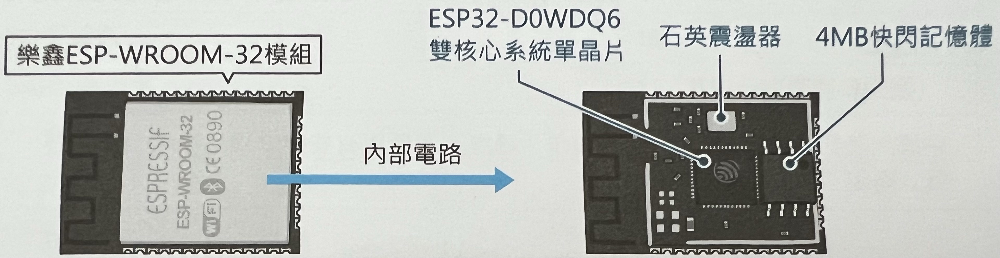
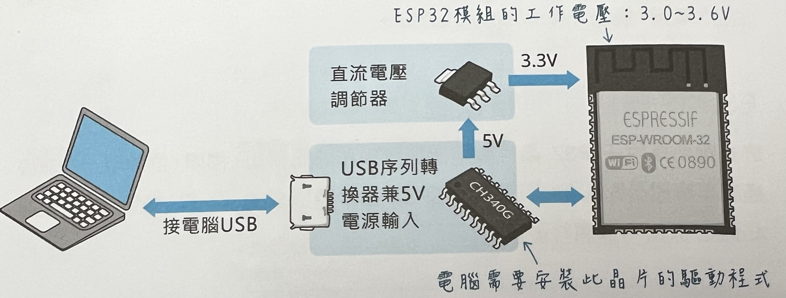

# 第一章 ESP32-S3和Arduino简介

## ESP32简介
### 什么是ESP32
ESP32是乐鑫信息科技（上海）股份有限公司(后文简称为乐鑫公司)研发，搭载了Wi-Fi和蓝牙的32位[系统单芯片](https://baike.baidu.com/item/%E7%B3%BB%E7%BB%9F%E5%8D%95%E8%8A%AF%E7%89%87/4497794) (System-on-a-chip，缩写SoC 或 SOC，其他译名有芯片系统、系统级芯片、片上系统)。ESP32的整体表现比较优秀[^1]：

- 性能稳定。工作温度范围达到 –40°C 到 +125°C。集成的自校准电路实现了动态电压调整，可以消除外部电路的缺陷并适应外部条件的变化。
- 高度集成。ESP32 将天线开关、RF balun、功率放大器、接收低噪声放大器、滤波器、电源管理模块等功能集于一体。ESP32 只需极少的外围器件，即可实现强大的处理性能、可靠的安全性能，和 Wi-Fi & 蓝牙功能。
- 超低功耗。ESP32 专为移动设备、可穿戴电子产品和物联网应用而设计，具有业内高水平的低功耗性能，包括精细分辨时钟门控、省电模式和动态电压调整等。
- Wi-Fi & 蓝牙解决方案。ESP32 可作为独立系统运行应用程序或是主机 MCU 的从设备，通过 SPI / SDIO 或 I2C / UART 接口提供 Wi-Fi 和蓝牙功能。

总的来说，ESP32是功能丰富的Wi-Fi & 蓝牙的通用MCU，适用于多样的物联网应用。

除此之外ESP32常常被某些开发板当作Wi-Fi和蓝牙的模组使用，称得上是多才多艺、物美价廉。

### ESP32模组

ESP32芯片有不同的型号，并且一直在推陈出新，以下是目前几种常见的型号：

- ESP32-D0WDQ6：最常见的型号，双核心。
- ESP32-C3：单核心 RISC-V 处理器，支持 Wi-Fi 4 和蓝牙5.0。
- ESP32-S3：双核心 LX7 处理器，支持 Wi-Fi 4 和蓝颜 5.0。

乐鑫公司有推出各种各样的 ESP32 模组，像下面这款 ESP32 WROOM-32 模组(后文简称 WROOM 模组)，是目前最常见的模组，常常被各种厂家在其基础上造出自己的开发板：

WROOM模组再加上直流电源管理芯片和UART转USB芯片，就能组成一个最基本的ESP32开发板。

也有的开发板不使用现成的模组，像我们在学习时使用的 DshanMCU-Mio(澪) 开发板，就是自行整合ESP32芯片和储存单元。我们将在下一节的文章了解 DshanMCU-Mio(澪) 开发板以及其开发套件。

## ESP32-S3开发平台

为了让广大电子爱好者更好更方便地学习 EPS32 开发，百问网 DShan MCU 团队打造了一系列高性价比地学习套件和周边模块。当前已经支持了 STM32 平台，灵动微平台(MM32)。我们的开发平台采用最小版+底板的设计形式，保留了官方原汁原味的兼容性的同时可以让学习、开发者能够更好地动手操作硬件、进行更多地拓展性实验；甚至融合到自己的项目中，拿去参加比赛等用途。

百问网 DShan MCU 系列提供了丰富的历程、文档和教程，基于我们的平台能确保所有的代码程序开箱即用，甚至可以将我们文档中的示例和实验应用在自己的产品研发、项目开发或者比赛中。

百问网 DShan MCU 系列资源、资料会保持活跃更新状态，如果你在学习时遇到任何相关的问题可以在我们的 [交流社区](https://forums.100ask.net/) 提问，会有专业的老师或者热心的同学一起帮你解决问题！

### DshanMCU-Mio(澪)开发板

DshanMCU-Mio(澪)开发板由百问网 DShan MCU 团队设计研发，有以下主要特点：

- 有文档教程在：Arduino 开发环境中学习、开发
- 有文档教程在：ESP-IDF 开发环境中学习、开发
- 有文档教程在：Micropython 开发环境中学习、开发
- 存储资源拉满：高达支持8MB的RAM和128MB的FLASH
- 自动下载电路
- USB OTG接口
- 全IO引出
- 按键和LED排列整齐，丝印清晰查看方便
- 可用来学习AI
- 支持百问网墨水屏和彩屏

【图】 DshanMCU-Mio(澪)引脚图

#### DshanMCU-Mio(澪)功能参数表
| 功能 | 描述 |
| ----------- | ----------- |
| 主控        |  ESP32-S3     |
| 内存        |  512KBytes + 2M-8MBytes PSARM(选配)     |
| FLASH       |  8M-128MBytes (选配)   |
| KEY         |  连接到引脚0     |
| I2C         |  支持任意IO    |
| UART        |  支持任意IO     |
| PWM         |  支持任意IO     |
| 双USB       |  1. USAR: 板载 USB转TTL   2.USB：USB OTG     |
| 5V          |  USB供电输入、对外供电输出     |
| 3.3V        |  3.3V输出，最大电流 600mA     |
| 墨水屏      |  支持局刷、快刷，提供LVGL开发教程、示例    |
| SPI彩屏     |  SPI接口，提供LVGL开发教程、示例     |

### DshanMCU-Mio(澪)开发套件

【图】 DshanMCU-Mio(澪)引脚图（墨水屏）

| 配置 | 描述 |
| ----------- | ----------- |
| 核心板        |  DshanMCU-Mio(澪)     |
| 底板        |  100ASK_ESP32-S3_Base-Board    |
| 显示屏        |  3.52寸SPI接口黑白两色墨水屏  |

【图】 DshanMCU-Mio(澪)引脚图（SPI彩屏）

| 配置 | 描述 |
| ----------- | ----------- |
| 核心板        |  DshanMCU-Mio(澪)     |
| 底板        |  100ASK_ESP32-S3_Base-Board    |
| 显示屏        |  3.5寸SPI接口TFT彩屏  |

### 100ASK_ESP32-S3_Base-Board

100ASK_ESP32-S3_Base-Board 是百问网 DShan MCU 团队针对 DshanMCU-Mio(澪) 在多开发平台上学习开发而量身定制的底板。可以用于在 Arduino、ESP-IDF、Micropython平台上进行学习、开发，通过100ASK_ESP32-S3_Base-Board能让我们能学习更多的内容做更多地实验；同时强大的拓展性，能让使用者能做更多的DIY。下面是100ASK_ESP32-S3_Base-Board的功能说明：

【图】 100ASK_ESP32-S3_Base-Board功能说明

| 接口 | 描述 |
| ----------- | ----------- |
| 2.54mm排针 引出   |  ESP32-S3     |
| 墨水屏接口        |  ESP32-S3     |
| TFT屏接口         |  ESP32-S3     |
| TFT屏触摸接口      |  ESP32-S3     |

### 配套模块

### 拓展配件

3.52寸SPI接口无触摸黑白两色支持快刷局刷墨水屏

3.5寸SPI接口电阻触摸彩屏

## Arduino简介

Arduino 是一个基于易于使用的硬件和软件的开源电子平台。

由于其简单易用的用户体验，Arduino 已被用于数千个不同的项目和应用程序中。Arduino 软件对于初学者来说易于使用，并且对于高级用户来说也足够灵活了，它可以在 Mac、Windows 和 Linux 上运行。

教师和学生用它来建造低成本的科学仪器，证明化学和物理原理，或者开始编程和机器人技术。设计师和建筑师构建交互式原型，音乐家和艺术家将其用于安装和试验新乐器。Arduino 是学习新事物的关键工具。任何人：儿童、业余爱好者、艺术家、程序员，都可以快速上手实现自己的想法！

Arduino 系列电路板的设计大多使用 Atmel AVR 单片机，并且Arduino一开始只支持这些电路板，但是Arduino是开源开放的平台，越来越多的开发者已经平台的涌入让其不断发展壮大，支持的硬件平台越来越多，我们现在使用的ESP32-S3在其发布不久之后就得到了支持(Arduino IDE)，这也就是说我们可以享用Arduino平台中数量庞大的代码库和模块硬件来快速实现我们的创想！这也是快速入门ESP32开发的很好的选择。

### Arduino相关学习资料

在我们学习的过程中，使用我们资料包中的资料已经足够你学习，如果你想深入学习可以根据这节的文档了解更多的内容。

#### 100ASK交流社区

遇到问题时可以在我们的[交流社区](https://forums.100ask.net/c/esp/49) 提问，会有专业的老师或者热心的同学一起帮你解决问题！

除了提问之外也可以浏览大家分享的各种创意项目，当然你也可以在这里留下你的成果展示分享给大家！

- 百问网交流社区： [https://forums.100ask.net/c/esp/49](https://forums.100ask.net/c/esp/49)

#### Arduino官方网站

[Arduino的官方网站](https://www.arduino.cc/) 是关于Arduino方面的最多、最权威的地方，你可以在这里获得更多的内容，或者获取最新的资讯。

- [https://www.arduino.cc](https://www.arduino.cc/)

#### Arduino文档

在Arduino的官方网站中提供了一个文档入口，我们可以在这里浏览关于Arduino的数百个教程、数据表、指南和其他的技术文档，可以说是应有尽有。这里单独列出来是因为我们在开发或者学习的时候，对于某些方面或者函数用法不太清楚的时候，绝大多数时候你都可以在这里得到你想要的答案。

- Arduino文档： [https://docs.arduino.cc](https://docs.arduino.cc)

[^1]:https://www.espressif.com.cn/zh-hans/products/socs/esp32

