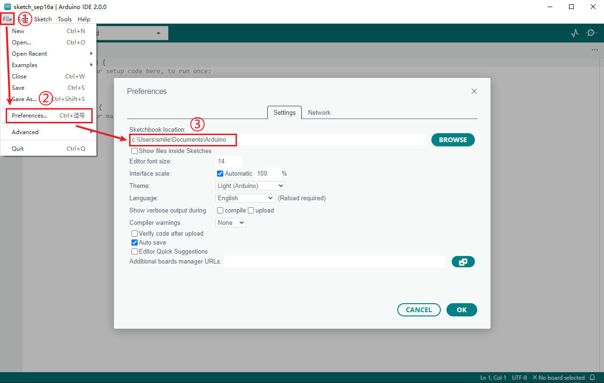
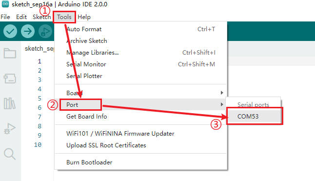
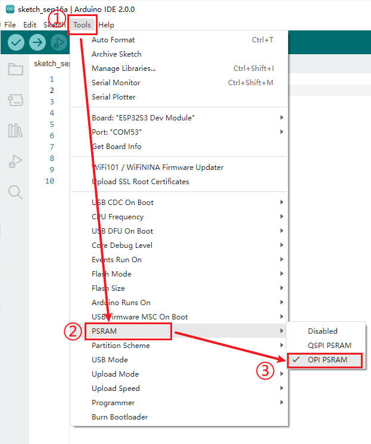
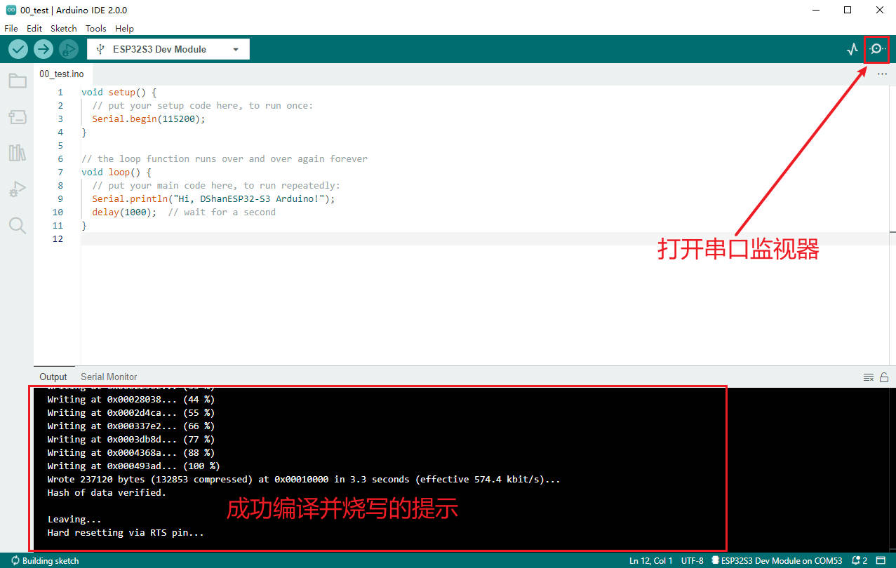

# 第二章 快速搭建开发环境

在上一章节中，我们了解了什么是ESP32、什么是Arduino。我们已经对这两个方面有了一定的了解，万事俱备，只欠东风。在正式开始学习或者说编程之前，我们还需要将我们的开发环境搭建起来。

搭建开发环境我们离不开两个东西： 硬件平台+软件平台。

下面我们就来动手将我们的 DshanMCU-Mio(澪) + Arduino IDE 开发环境搭建起来。这其中我们提供了多种系统平台的搭建方法，你只需要选择你常用的一种平台即可，比如你的PC使用的是Windwos系统，那么只需要看 Windows 平台的部分即可。

## 基于Windows平台
Windows应该是大家常见的工作平台，即使是我们这些开发人员也是如此。所以我们也是推荐大家使用Windows平台作为首选的开发环境，并且推荐使用 Windows 10 系统。因为微软官方已经官宣停止对Windows 7 的更新和维护，所以我们最好不好使用windows 7以及比windows 7 更低的版本来搭建开发环境，否则可能会出现各种不必要甚至是无法得到解决的问题。

windows 10还有一个优点是，很多驱动都能自动联网安装，免去了我们手动安装的麻烦，比如我们将 DshanMCU-Mio(澪) 第一次接入我们PC上的时候，如果安装的是Windwos 10系统，那么会有弹窗提示正在安装驱动，这是非常智能方便的。

当然了，如果你确实智能使用其他版本的Windows系统，那么在出现问题的时候也是可以在我们的 [交流社区](https://forums.100ask.net/c/esp/49) 提问，会有专业的老师或者热心的同学一起帮你解决问题！


### 安装Arduino IDE

安装Arduino IDE有两个方法：

- 使用需要安装的安装版 Arduino IDE
- 使用开箱即用的绿色版 Arduino IDE

因为 Arduino IDE 默认没有适配 ESP32-S3 开发环境，所以不管使用哪种安装方法，我们都要在能打开 Arduino IDE 之后，再进一步配置我们的 ESP32-S3+Arduino 开发环境，这个配置过程都是一样的，我们提供了很简便的配置方法。

下面我们先分别了解这两种安装方法。

#### 安装版 Arduino IDE

需要将 Arduino IDE 安装到我们的PC中，安装完成之后可以将安装包删除，相比绿色版麻烦很多。

- 首先，我们找到 `03_开发工具/arduino-ide_2.0.0_Windows_64bit.exe` 安装包所在的目录
- 然后，双击 `arduino-ide_2.0.0_Windows_64bit.exe` 按照默认的选项进行安装


- 最后，安装完成你可以在桌面看到多出来了一个叫 `arduino` 的快捷方式的图标，以后我们双击改图片即可打开 `Arduino IDE`。

#### 绿色版 Arduino IDE

绿色版的意思是不需要将 Arduino IDE 安装到我们的PC中，解压之后进入压缩包目录双击 `Arduino IDE.exe` 即可打开 Arduino IDE 进行开发，相对于安装版来说方便很多，但是我们要保留我们的解压出来的文件。

- 首先，我们找到 `03_开发工具/arduino-ide_2.0.0_Windows_64bit.zip` 压缩包所在的目录
- 然后将 `arduino-ide_2.0.0_Windows_64bit.zip` 解压到你自定义的目录(也可以直接解压到当前文件夹中)
- 最后，进入到 `arduino-ide_2.0.0_Windows_64bit` 目录，打开 `Arduino IDE.exe` 即可看到IDE界面

为了方便后面的使用，建议将 `arduino-ide_2.0.0_Windows_64bit.zip` 解压到一个你认为可以很好存放软件的目录，比如 `D:\SoftWare`。还有你可以像下图这样创建 `Arduino IDE.exe` 的快捷方式在桌面或者固定到任务栏或者导航栏，这样我们以后就可以很方便地打开 `Arduino IDE`。

### 配置 ESP32-S3+Arduino 开发环境

在我们能打开 `Arduino IDE` 并且进入主界面之后，我们就可以配置 ESP32-S3+Arduino 开发环境了。

如果使用我们的配套资料，那么配置过程非常简单，但是有两个前提条件要满足：

- 能打开 `Arduino IDE` 并且进入了主界面
- 下载了我们的配套资料

上面这两个条件都满足了之后按照下面的步骤操作： 

打开 Arduino IDE 开发板管理目录，我这里是下面这个路径

```shell
C:\Users\100ask\AppData\Local\Arduino15
```

也就是注意留意看你的用户名是多少，我们按照下图这样操作可以确定当前使用的用户名是哪个：



很明显，图中的用户名是 `smile` 路径是 `C:\Users\smile` 那么按照上面的说明，我们可以定位到自己的开发板管理目录：

```shell
C:\Users\smile\AppData\Local\Arduino15
```

我们将修改后的路径复制下来，打开Windows系统的 `文件资源管理器` ，按照下图步骤进行操作：


我们继续进入到 `packages` 目录，看到内容是下图这样的：


我们接下来需要将我们的esp32开发板包(packages)添加进去即可，这个“包”在目录：


如果你安装了解压缩工具，那么解压到指定目录非常简单：

- 你可以选中压缩包，然后点击鼠标右键选择 `解压到...` 即可
- 你可以双击打开压缩包，然后全选压缩包中的内容，将其拖动到指定目录即可(先在packages目录新建esp32目录再拖动到当中)。

> 无论是哪种解压方式，都要确保我们增加的开发板包的目录是 `esp32`。

这是esp32目录中的内容，主要路径要和图中的一样：


这样就大功告成，我们打开(重启)我们的 `Arduino IDE` 后，依次选择： `tools->Board' 就能看到多出来了 esp32 的选项：


### 开发套件的使用

#### 安装驱动

按照上面的操作，我们已经配置好开发环境，下面我们再来看看怎么在 `Arduino IDE` 中使用 DshanMCU-Mio(澪) 进行开发。

我们将 DshanMCU-Mio(澪) 上印有 UART 的 Type-C 接口，通过配套的 Type-C 线连接到我们的PC上的USB接口上，如下图所示：


在 Windows 10 操作系统中，一般在你接上之后不久就会提示正在自动安装驱动。

我们右键点击 **“我的电脑”** ，然后依次点击： 属性->设备管理。打开 **设备管理器** 界面之后能看到 `端口(COM和LPT)`选项， 并且其中有新接入的设备串口(COM)号，说明驱动没有问题，可以正常使用。


如果 **驱动异常**，那么就是你PC的系统无法自动安装驱动，这时候就需要我们 **手动安装驱动** ，方法如下：

如果驱动异常，我们新接入的设备会显示一个 **黄色的感叹号**，我们选中这个设备项，然后点击鼠标右键，在弹出的菜单栏中选择 `更新驱动程序`：


然后会弹出一个页面，我们选择 `“浏览计算机查找驱动”`：

驱动的路径选择： `DShan-ESP-S3_Arduino学习资料\03_开发工具\`，点击 `“确定”` 后就会安装驱动。


驱动安装完成之后，再检查 **设备管理器** 中是否有串口(COM)号。

> 资料中的驱动是压缩包，我们要先解压这个压缩包再选择驱动，这里略过解压操作教程。


#### 烧写程序

按照上面小节的操作，我们的驱动没有问题可以使用之后，我们就可以在 Arduino IDE 中和我们手上的 DShan-ESP-S3 进行交互了，我们先来烧写一个程序。

首先，我们打开资料中的示例代码： 


然后，按照下图在 Arduino IDE 进行一些配置：

1. 选择在 `Tools->Board->ESP32 Arduino(inSketchbook)` 中选择 `ESP32S3 Dev Module`


2. 然后在 `Tools->Port` 中选择中选择你的板子的串口(COM)号：



这样我们在 Arduino IDE中就能看到我们刚才的选择： 


3. 我们再进行一些细节配置，按照上面两步操作之后我们能看到菜单栏中 `Tools` 选项多出来了很多选项，大部分选项我们保持默认选择，我们只需要配置下面这几个即可：

根据自己板子的配置选择对应的 **Flash Size**，DShan-ESP-S3 提供这三种配置的选购：


`PSRAM` 默认是 *Disabled* 我们选择为 `OPI PSRAM`



最后，我们点击烧录按钮，等待编译并烧写完成：


编译并烧写完成之后，我们点击右上角的 **串口监视器** 查看串口输出的内容：



可以看到串口监视器每隔 1s 会输出一次信息：


至此，我们的开发环境就完全搭建好了，接下来的章节中我们开始进行更多的实验、学习更多的内容吧！

## 基于Linux平台(Ubuntu)
待续...

## 基于MacOS平台
待续...


