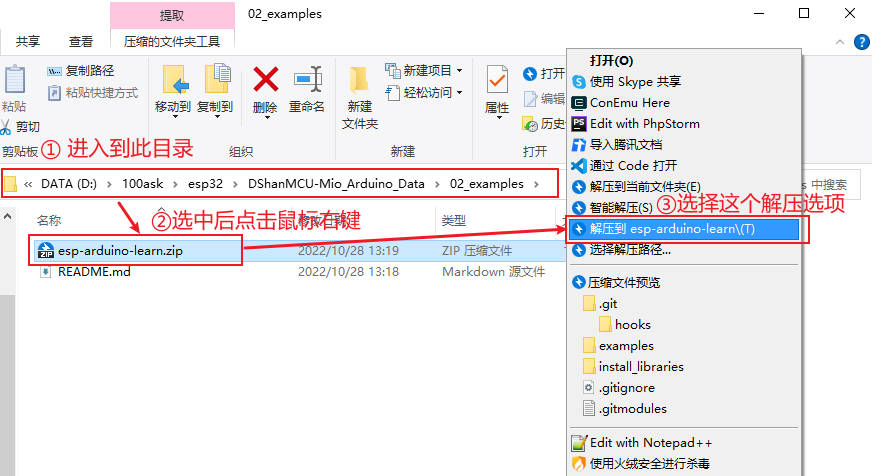

# 运行第一个程序(Hello world!)

在 [第二章 快速搭建开发环境](DShanMCU-Mio/Arduino/chapter2-1.md) 中已经获取了我们的学习资料，在使用这一份资料之前这里再强调一次：

> 我们存放学习资料的路径不要有中文及中文字符和其他特殊字符，建议路径全都是英文+阿拉伯数字+英文标点符号(其中不要使用英文符号`(` 和 `)` )。 否则会出现一些意想不到的问题，这都是不必要可以提前避免的问题。

> 如果使用的是 windows 系统，要注意路径长度问题。在编译某些工程可能会编译不过，这时候首先考虑是否路径过长导致的，建议将整个资料包移动到磁盘根目录之后，清除(Full Clean)之后再重新编译。

## Windows平台

笔者在 windows 系统中，将资料存放在了 `D:\100ask\esp32` ，路径中没有中文及中文字符和其他特殊字符以及符号`(` 和 `)`：

然后进入到下面所示的目录，按照提示解压压缩包：

### 打开示例工程

首先，我们打开资料中的示例代码： 

#### 配置

然后，按照下图在 Arduino IDE 进行一些配置：

1. 选择在 `Tools->Board->ESP32 Arduino(inSketchbook)` 中选择 `ESP32S3 Dev Module`

2. 然后在 `Tools->Port` 中选择中选择你的板子的串口(COM)号：

这样我们在 Arduino IDE中就能看到我们刚才的选择： 

3. 我们再进行一些细节配置，按照上面两步操作之后我们能看到菜单栏中 `Tools` 选项多出来了很多选项，大部分选项我们保持默认选择，我们只需要配置下面这几个即可：

根据自己板子的配置选择对应的 **Flash Size**，DShan-ESP-S3 提供这三种配置的选购：

`PSRAM` 默认是 *Disabled* 我们选择为 `OPI PSRAM`

#### 编译烧写

最后，我们点击烧录按钮，等待编译并烧写完成：

> 点击上图指示的按钮是 **编译+烧写** 也就是说在编译通过之后会直接烧写。你也可以分开两步进行：上图指示按钮的左边是一个 `√` 勾勾的按钮，点击这个是编译验证，但是不会执行烧写操作，验证通过之后再点击上图指示的按钮进行烧写。

#### 打开串口监视器查看运行现象

编译并烧写完成之后，我们点击右上角的 **串口监视器** 查看串口输出的内容：

可以看到串口监视器每隔 1s 会输出一次信息：

## Ubuntu平台

待续...

## MAC平台

待续...
