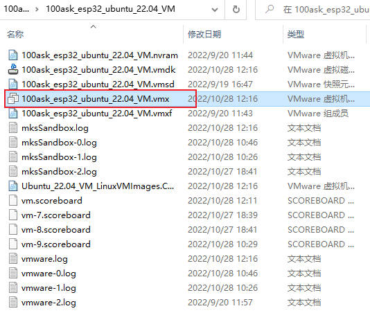
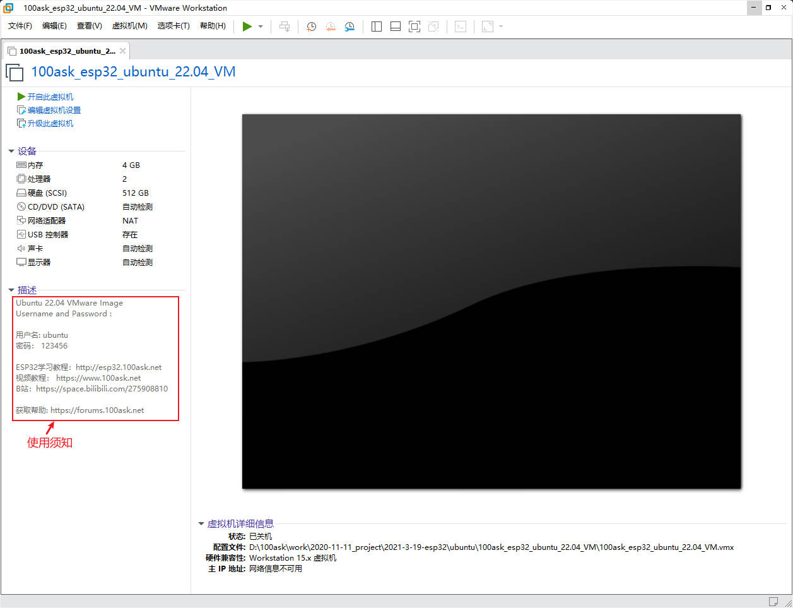
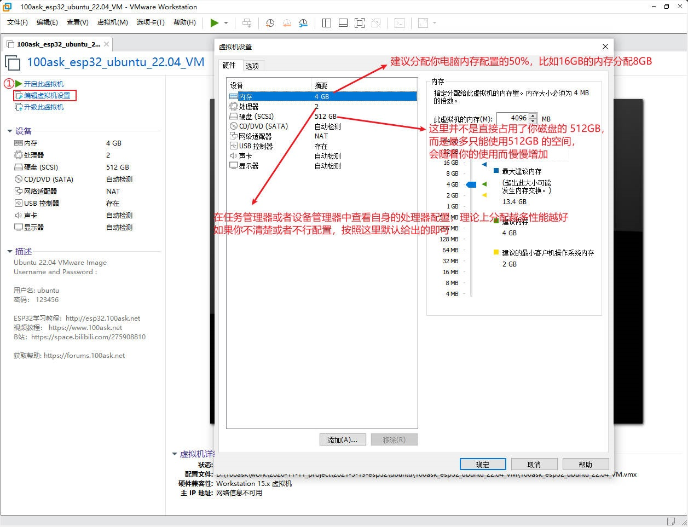
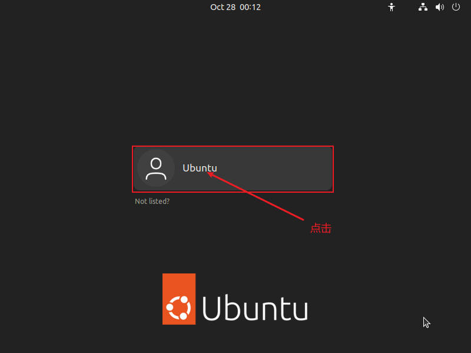
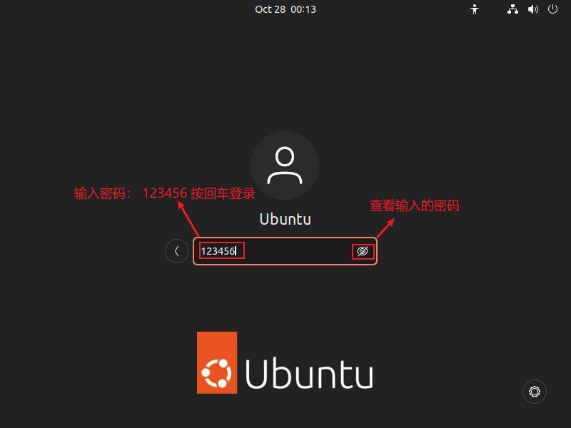
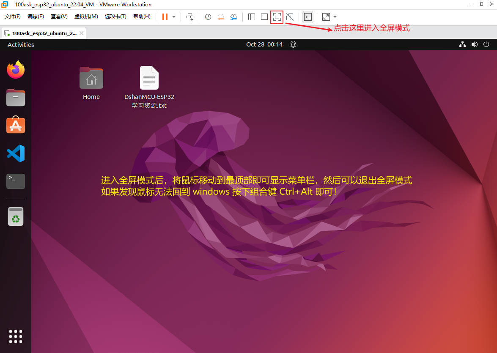

# 【推荐】基于Linux平台(Ubuntu)

在linux平台上进行开发是我们推荐的方式，乐鑫官方也是推荐使用这种开发环境。

DshanMCU-ESP32虚拟机环境配置：

- ubuntu 22.04 版本
- 安装了 esp-idfv4.4.2 (已为所有支持的目标芯片安装工具) `./install.sh all`
- 安装适配了 vscode+esp-idf 插件
- 安装适配了 platformIO + esp32
- 安装适配了 Thonny（为micropython准备）
- 安装适配了 Arduino v2.0.1（为arduino准备）

## 下载资料

虽然在linux平台上进行学习开发的门槛比 windows 高，但是按照我们的教程学习会带你逐步熟悉深入了解linux的各种特性和玩法，所以请先忽略那座横在你面前无形大山吧！

linux平台的开发环境搭建非常简单，因为我们已经制作好了一个虚拟机镜像，解压就能直接用！

所以我们的第一步是非常简单的，首先，我们先下载好我们的虚拟机镜像资料，下面请选择你喜欢的下载方式进行下载：

| 下载平台 | 下载链接 | 提取码 |
| :---    | :---     | :---: |
| [百度云盘](https://pan.baidu.com/)       | [https://pan.baidu.com/s/1S1Toy5RAakTHvYtKZuvcqA?pwd=root](https://pan.baidu.com/s/1S1Toy5RAakTHvYtKZuvcqA?pwd=root)  | root |
| [阿里云盘](https://www.aliyundrive.com/) | [https://www.aliyundrive.com/s/qdPb9cL364h](https://www.aliyundrive.com/s/qdPb9cL364h) | 96jp |

> 100ask_esp32_ubuntu_22.04_VM 解压后占据约 **26GB** 的磁盘空间，解压之前请确保磁盘容量充足！

## 解压、安装

耐心等待下载完成，下载完成后进入资料目录：

1. 如果你的电脑没有解压缩工具，那么需要解压并安装 **tools/BANDIZIP-SETUP-STD-X64.zip** 或者前往 bandizip 的官网获取更新版本：[https://www.bandisoft.com](https://www.bandisoft.com)

2. 如果你的电脑没有安装 VMware-workstation 那么也需要解压并安装 **tools/VMware-workstation-full-16.2.3-19376536.zip**
或者前往 VMware 的 [官网](https://www.vmware.com) 获取更新版本： [https://www.vmware.com](https://www.vmware.com)

3. 接下来将 100ask_esp32_ubuntu_22.04_VM 目录中的所有压缩包全部下载好，一个也不能少，检查是否和下图一样！

然后，选中名为 100ask_esp32_ubuntu_22.04_VM.zip 的压缩包，右键进行解压，可以选择解压到当前目录，但是建议将其解压到可以专门存放虚拟机的目录，因为后续要经常使用并且解压出来之后约占 31GB 的磁盘空间！

> 解压时间大概需要 15~30 分钟可能需要更长的时间，不同的电脑性能结果会不一样。

4. 解压完成之后，进入到解压出来的 `100ask_esp32_ubuntu_22.04_VM` 目录，如果前面安装了 `VMware-workstation` 那么将能看到 `100ask_esp32_ubuntu_22.04_VM.vmx` 是能通过你的电脑打开的，我们双击打开它：

> 解压完成之后，并且确认 100ask_esp32_ubuntu_22.04_VM 可以正常使用，那么此时可以将之前的压缩包删除以节省磁盘空间。

5. 之后我们将会进入到 VMware-workstation 的程序界面，并且展示我们刚刚选中打开的虚拟机，界面是这样的：

## 配置并打开虚拟机

我们先不要急着打开虚拟机，先配置一下我们的虚拟机：

然后我们点击 `开启虚拟机` 打开我们的虚拟机：

## 登录Ubuntu

等待登录界面加载出来，点击用户 `Ubuntu`:

然后输入登录密码 `123456` 按回车即可登录：

最后我们会进入到 ubuntu 的桌面，以后使用起来你会发现很多交互操作其实和我们熟悉的 windows 是差不多的！

