# 运行第一个程序(Hello world!)

在 [第二章 快速搭建开发环境](./chapter2.md) 中已经获取了我们的学习资料，在使用这一份资料之前这里再强调一次：

> 我们存放学习资料的路径不要有中文及中文字符和其他特殊字符，建议路径全都是英文+阿拉伯数字+英文标点符号(其中不要使用英文符号`(` 和 `)` )。 否则会出现一些意想不到的问题，这都是不必要可以提前避免的问题。

## windows平台

笔者在 windows 系统中，将资料存放在了 `D:\100ask\esp32` ，路径中没有中文及中文字符和其他特殊字符以及符号`(` 和 `)`：

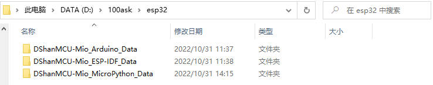

然后进入下面所示的目录，按照提示解压压缩包：

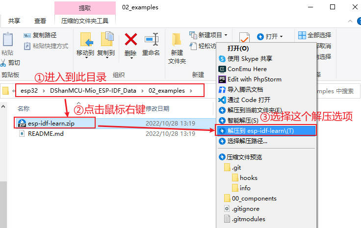

压缩包解压出来之后，我们进入到下面所示的目录，打开我们的第一个项目：

### 通过vscode开发

我们进入到下面的路径，通过vscode打开我们的项目进行学习开发：

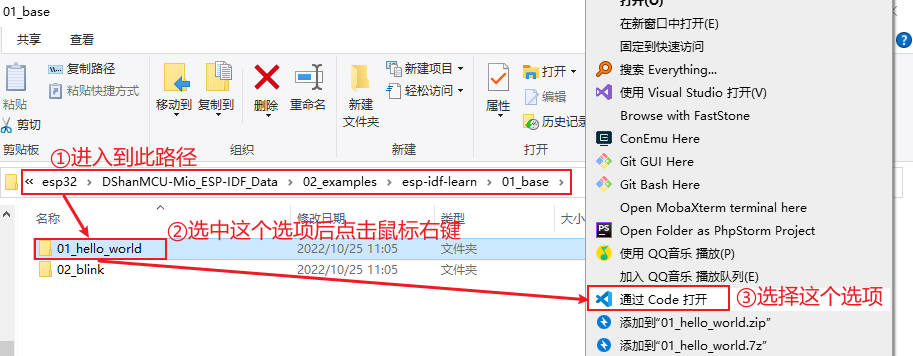

在vscode中打开项目之后，我们先编译看看：

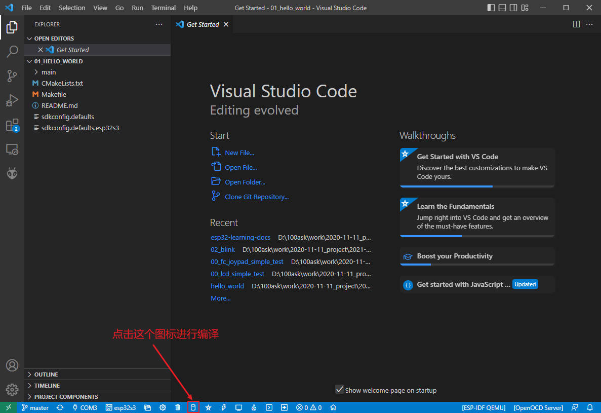

在windows下编译过程需要一些时间(会比在ubuntu下编译慢很多)，但是最后我们会顺利完成编译！接下来我们将程序烧录到我们的开发板中：

首先，将我们配套的 Type-C 数据线，按照下图所示接到我们的开发板上，另一端接到我们电脑的USB接口上：

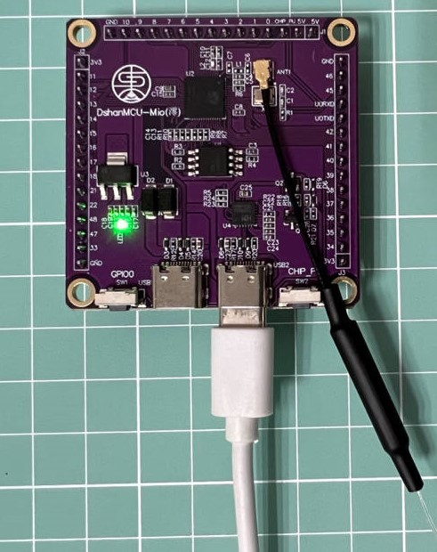

然后，我们按照下图的操作在vscode中选择我们开发板的COM口，每次插拔编号可能会不一样也可能还是一样，当你不确定或者出问题的时候可以多插拔几次看看：

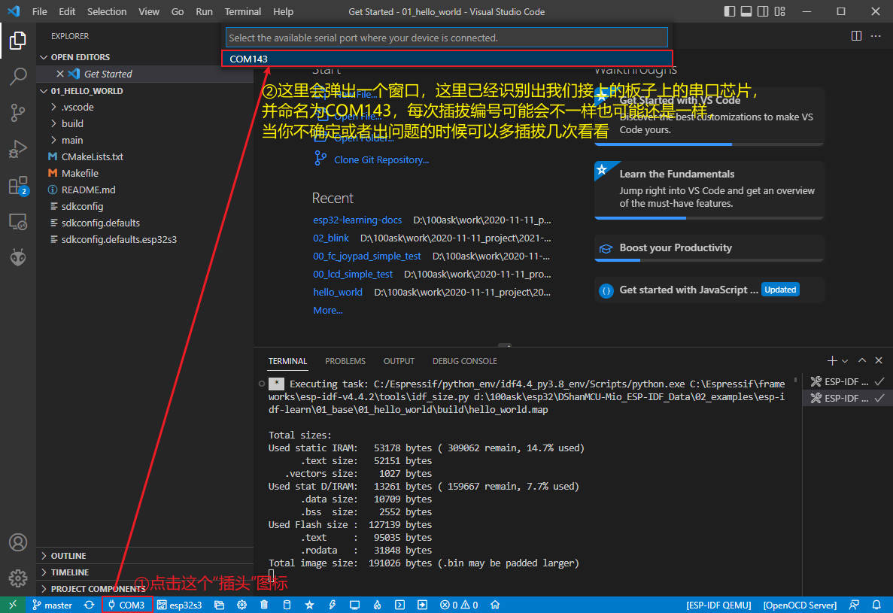

最后，在选择COM之后还要选择一个项目，我们这里只打开了一个项目：

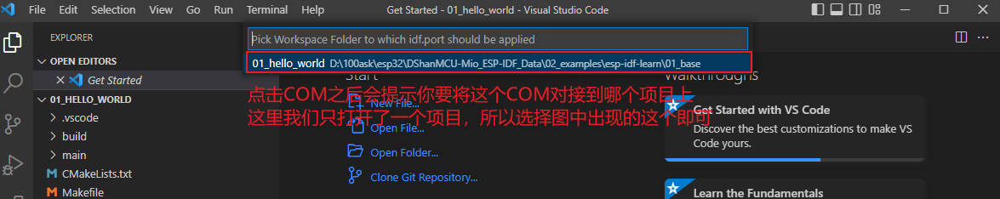

然后我们点击烧写按钮，进行烧写：

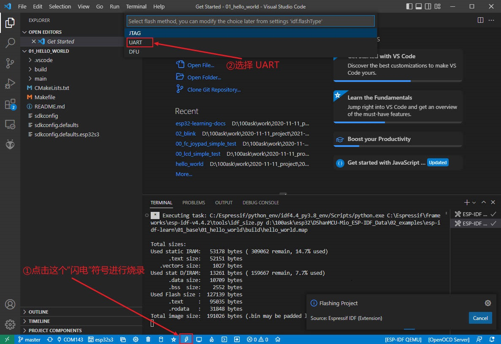

烧写完成提示：

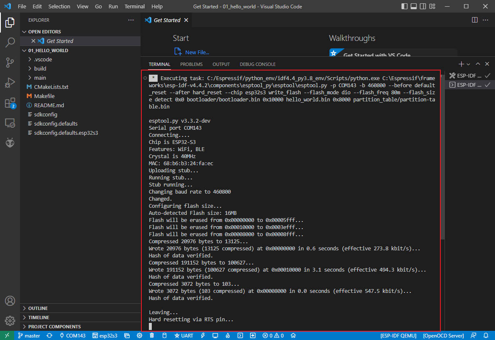

烧写成功！接下来我们通过vscode打开串口监视器，查看程序运行时的输出信息：

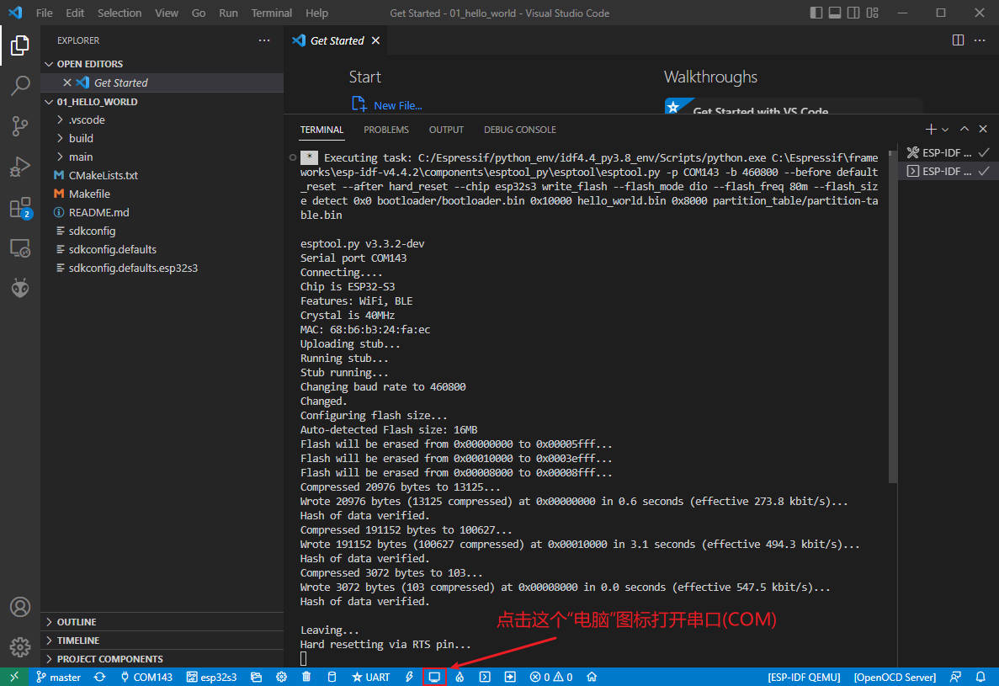

可以看到，在倒计数结束后会进行重启，现在起我们板子中的程序就是这样不断地循环执行。

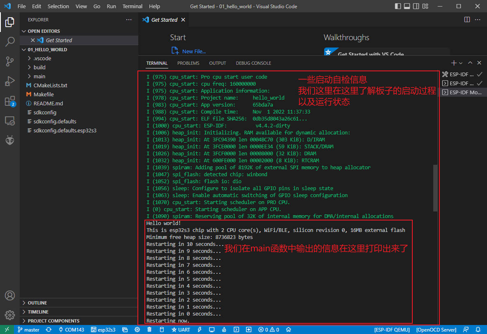

## ubuntu平台

笔者在 ubuntu 系统中，使用的是百问网制作好的ubuntu虚拟机，在其中资料示例源码存放在了 `~/work` 目录下，路径中没有中文及中文字符和其他特殊字符以及符号`(` 和 `)`：

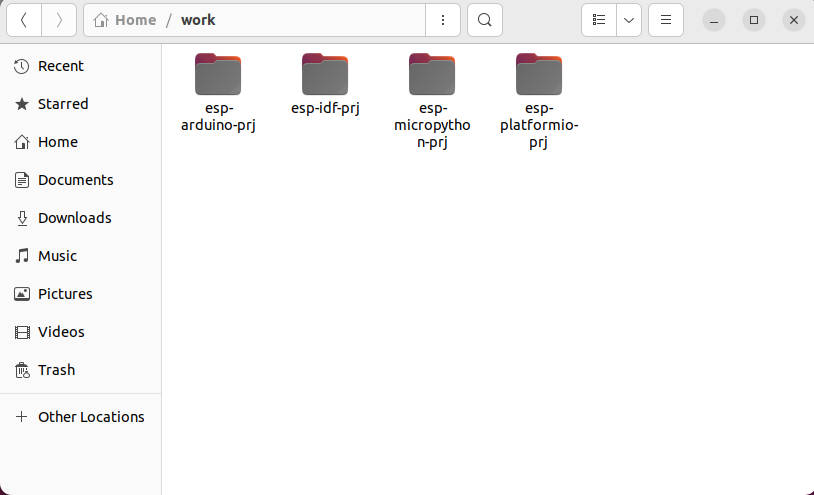

> 如果你使用自己的虚拟机或其他linux平台进行开发，请注意遵循上面提到的注意事项。

### 通过vscode开发

我们进入到下面的路径，通过vscode打开我们的项目进行学习开发：

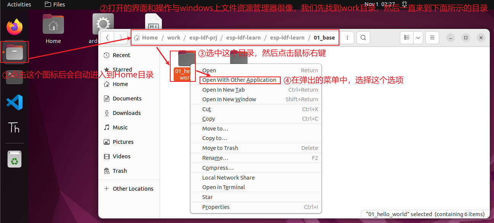

然后选择通过 Visual Studio Code 打开，然后你会看到打开的界面和在windows 上是一样的：

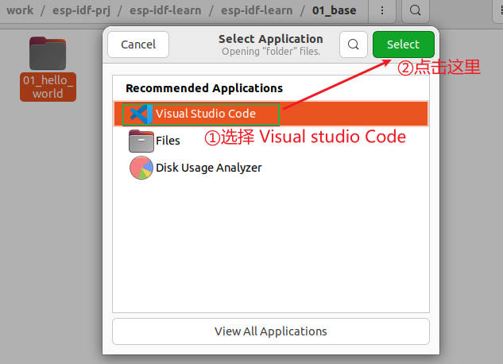

在vscode中打开项目之后，我们先编译看看：

在windows下编译过程需要一些时间(会比在ubuntu下编译慢很多)，但是最后我们会顺利完成编译！接下来我们将程序烧录到我们的开发板中：

首先，将我们配套的 Type-C 数据线，按照下图所示接到我们的开发板上，另一端接到我们电脑的USB接口上：

然后我们会看到我们的 VMware Workstation 中提示要将设备连接到哪里，我们按照下图连接到 ubuntu：

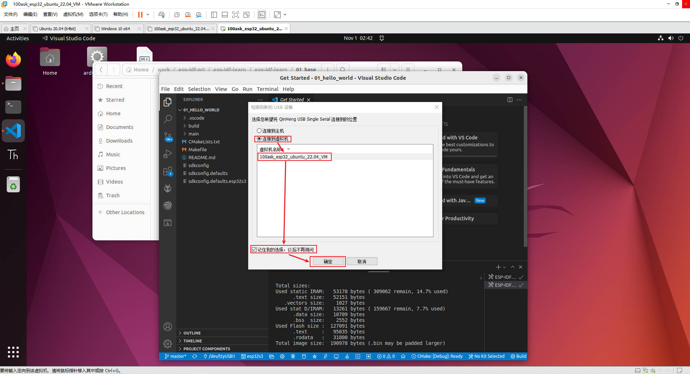

如果没有出现这个弹窗，并且按照下面的操作没有出现新的设备(一般是点击下面COM那里没有反应)，此时我们要按照下图这样检查一下，如果没有连接，那么点击连接，如果不确定是哪个选项，可以插拔对比检查看看是哪一个，后面基本都是这个选项：

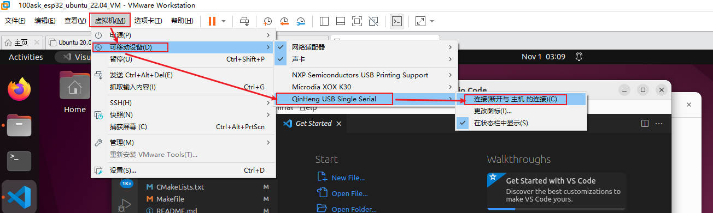

然后，我们按照下图的操作在vscode中选择我们开发板的COM口(这里引用的图片是上文windows平台的演示图片正常是 `/dev/ttyACM0` )，每次插拔编号可能会不一样也可能还是一样，当你不确定或者出问题的时候可以多插拔几次看看：

最后，在选择COM之后还要选择一个项目，我们这里只打开了一个项目：

然后我们点击烧写按钮，进行烧写：

烧写完成提示：

烧写成功！接下来我们通过vscode打开串口监视器，查看程序运行时的输出信息：

可以看到，在倒计数结束后会进行重启，现在起我们板子中的程序就是这样不断地循环执行。

