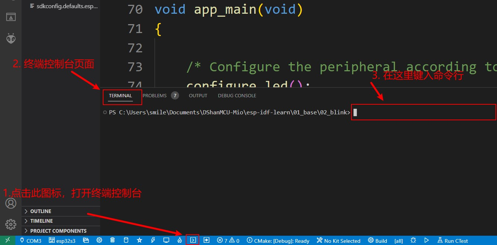
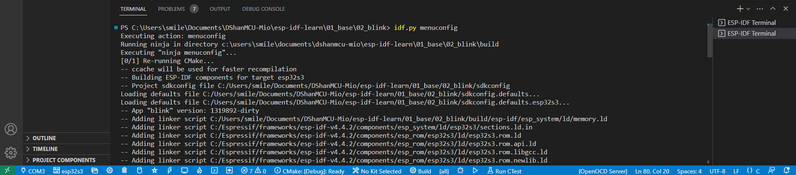
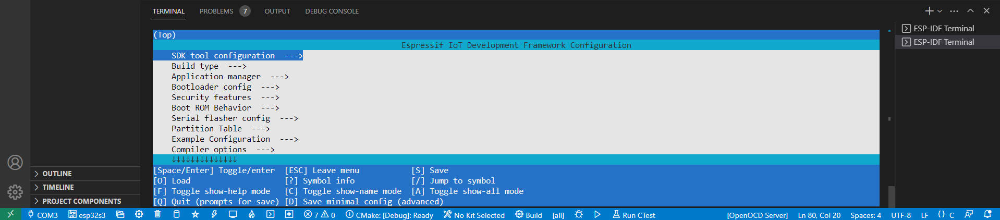
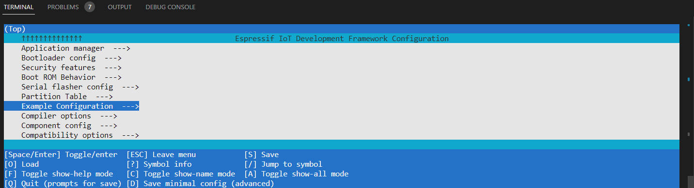
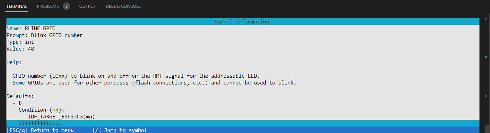
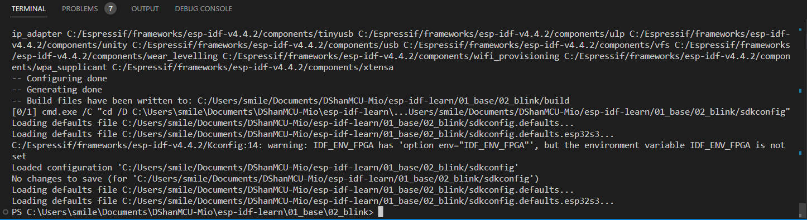

# 点亮LED(BLINK)

从这里开始直到后面的示例讲解，不再重复演示怎么在各个平台上打开我们的项目工程进行操作。如果你还是不太清楚步骤，请回头查看前面两章的内容再继续阅读。


## 硬件准备

- 发光二极管(LED灯)  * 1

ESP32-S3有 45 个可编程 GPIO 管脚，除了一些具有特殊用途的GPIO外，大部分GPIO都可以复用。
DShanMCU-Mio没有板载LED灯，所以我们需要将LED灯的正极(较长的那根引脚)接在板子上，默认使用的是 GPIO48 ，负极(较短的那根引脚)接在板子的 GND 引脚上。


## 软件准备

本次实验的项目代码位于： `DShanMCU-Mio_ESP-IDF_Data/02_examples/esp-idf-learn/01_base/02_blink` 。

> 注意，不要将项目代码移动到其他地方，否则后续可能会出现编译报错的问题。后续实验也请保持原有的目录结构进行学习，不要移动项目代码的位置。


## 打开项目工程

如果你对ESP-IDF不太熟悉请按照上一章节所演示的操作步骤，通过 vscode 打开进行编辑、编译、烧写等操作。有基础的通过可以直接通过终端控制台打开进行操作。

## 运行现象

直接点击编译即可，烧写到开发板之后。打开 vscode 中的串口控制台（或使用其他串口工具：波特率 115200）即可看到有输出信息。如果已经接上LED灯，那么能看到 LED 灯在闪烁，并且和控制台输出的状态信息一样。

## 关键代码解读

```c
// 将 gpio 重置为默认状态（选择 gpio 功能，启用上拉并禁用输入和输出）。
// 这个函数还会将此引脚的 IOMUX 配置为 GPIO 功能，并断开通过 GPIO 矩阵配置的任何其他外设输出。
gpio_reset_pin(BLINK_GPIO);

// 配置GPIO的方向，如output_only,input_only,output_and_input
gpio_set_direction(BLINK_GPIO, GPIO_MODE_OUTPUT);

// 设置 GPIO 的输出电平。
gpio_set_level(BLINK_GPIO, s_led_state);

// 延时 CONFIG_BLINK_PERIOD 毫秒。
// 比如 vTaskDelay(100 / portTICK_PERIOD_MS); 是延时100ms。
vTaskDelay(CONFIG_BLINK_PERIOD / portTICK_PERIOD_MS);

// 和printf函数一样，输出日志信息。
ESP_LOGI(TAG, "Turning the LED %s!", s_led_state == true ? "ON" : "OFF");
```

在ESP-IDF中一般我们使用 ESP_LOGx 输出日志信息，日志打印等级有：

- ESP_LOGE -错误（最低）
- ESP_LOGW - 警告
- ESP_LOGI -信息
- ESP_LOGD -调试
- ESP_LOGV -详细（最高）


> 为什么不用 printf 打印日志信息？ESP-IDF基于 freeRTOS，而FreeRTOS是一个抢占式的实时多任务系统，抢占就意味着任务之间有优先级，高优先级的任务可以打断低优先级的任务。因为 printf 是一个不可重入函数，而在中断中要避免调用不可重入函数(在freeRTOS多任务中也是一样)。区分一个函数是否可重入就是看这个函数能否在未返回的时候再次被调用。而造成一个函数不可重入的原因往往是使用了全局变量，如果一个函数未返回再执行一次会导致对全局变量的操作是不安全的。就例如我们常用的printf、malloc、free都是不可重入的函数，printf会引用全局变量stdout，malloc，free会引用全局的内存分配表，在多线程的环境下，如果没有很好的处理数据保护和互斥访问，就会发生错误。
所以使用printf是不够安全的，为此ESP-IDF提供了自己的安全接口 **ESP_LOGx**。


## 修改默认使用的LED引脚

我想修改默认使用的LED引脚怎么办呢？这很简单，我们只需要在代码中修改一下 BLINK_GPIO 宏即可，但是 BLINK_GPIO 使用的是另一个宏 CONFIG_BLINK_GPIO ，我们可以在 `sdkconfig` 文件中找到这个宏定。是不是修改这里的宏定义指定的引脚编号就行了呢？

这是不行的，我们不能直接修改 `sdkconfig` 文件中的任何内容，因为会不生效，点击编译的时候你会发现它又变回原来的状态了，那么到底应该是在哪里修改这个宏呢？

其实很简单，esp-idf为我们提供了很好的配置方法，那就是使用 menuconfig 具体使用方法步骤请继续看下面的内容：


在 vscode 打开终端控制台：




在命令行中输入 `idf.py menucofig` ，然后按回车等待执行完毕之后会出现一个menuconfig配置界面，在这里我们可以通过键盘进行选择、配置：





esp-idf menuconfig 基本操作说明：

1. 按键盘方向键的四个按钮中的 **上键** 和 **下键** 上下切换到不同的选项，高亮部分会跳转在不同的选项上，
2. 当移动到末尾带有 `--->` 的选项时，按方向键上的 **右键** 可以进入到其中，进行更多的配置；按 **左键** 回到上一页面
3. 反之遇到没有 `--->` 的选项，看情况而定：如果只能配置 使能 或 失能(最左边的符号是 `[]`)，那么按 **回车键(Enter)** 或 **空格键(Space)** 即可；如果需要输入字符指定(最左边的符号是 `()`)，那么需要先按 **?** (英文输入模式下)键，查看输入格式要求说明，阅读了解说明之后，按键盘的 **q/Q** (英文输入模式下)键，关闭阅读页面，之后再按 **回车键(Enter)** 或 **空格键(Space)** 打开输入栏进行输入，
4. 按 **q/Q** (英文输入模式下)键 退出 menuconfig，回到终端控制台，注意保存进行的修改，完全推出前会有提示你是否保存。


下面我们尝试修改 LED 灯的默认引脚：

1. 参考上面的操作，打开终端控制台、输入 idf.py menuconfig 进入到 menuconfig 配置界面。
2. 按 **上键** 和 **下键** 上下切换到不同的选项，找到如下图所示的 `Example Configuration  --->` 选项：




3. 按 **回车键(Enter)** 或 **空格键(Space)** 进入新页面，继续找到 `(48) Blink GPIO number` 选项，然后
按  **?** (英文输入模式下)键查看说明信息：



4. 按 **q/Q** 键退出说明界面，然后再该选项下按 **回车键(Enter)** 或 **空格键(Space)** 打开输入框，输入你想要配置的引脚编号后按 **回车键(Enter)** 即可：

5. 按 **q/Q** (英文输入模式下)键 退出 menuconfig，回到终端控制台，注意保存进行的修改，完全推出前会有提示你是否保存。




之后就可以重新编译、烧写到开发板，程序会按照刚配置的修改运行。


> 其实我们可以直接在代码中指定我们想使用的 GPIO 引脚，比如 `#define BLINK_GPIO 18` 配置项很少的时候这样的方法是没有问题，就算是这样一般我们也不会这么做。

> menuconfig 能便捷的对工程进行配置，而不需要修改代码，并且其中还能对该配置进行详细的说明，当我们的配置项非常多的时候这就显得尤为重要并且不可或缺。所以最好从一开始就养成使用 menucofig的习惯！

