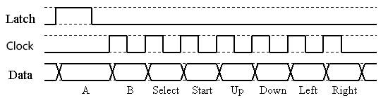

# FC游戏机手柄

此章节讲述使用 **[FC游戏机手柄](https://item.taobao.com/item.htm?id=683875901407)** 的按键控制方式。

## 硬件准备

- [FC游戏机手柄](https://item.taobao.com/item.htm?id=683875901407)    * 1
- [Micro USB模块](https://item.taobao.com/item.htm?id=683875901407)  * 1

FC手柄有10个按键（实际上只有8个）：

上、下、左、右、Start、Select、A、B、A连发、B连发。

A和A连发是一个键值，而B和B连发也是一个键值，只是连发按键当你一直按下的时候，会不停的发送（方便快速按键，比如发炮弹之类的功能）。

FC手柄的控制电路，由1个8位并入串出的移位寄存器，外加一个时基集成电路（用于连发）构成。读取手柄按键值的信息十分简单：先Latch（锁存键值），然后就得到了第一个按键值（A，下降沿采集），之后在7个Clock的作用下，依次读取其他按键的键值，总共8个按键键值。

### 接线

| Micro USB引脚 | FC游戏机手柄芯片引脚 | Mio 引脚 |
| :--- | :--- | :--- |
| VCC | VCC | 3.3v/5v|
| GND | GND | GND|
| ID | CLOCK | 40 |
| D+ | LATCH | 41 |
| D- | DATA | 42 |


### FC游戏机手柄时序图

每给一个脉冲，就输出一位数据(按下是1，松开是0.)，输出顺序:
A->B->SELECT->START->UP->DOWN->LEFT->RIGHT.




## 软件准备

本次实验的项目代码位于： `DShanMCU-Mio_ESP-IDF_Data/02_examples/esp-idf-learn/03_controller/fc_joypad` 。

> 注意，不要将项目代码移动到其他地方，否则编译会报错。后续实验也请保持原有的目录结构进行学习，不要移动项目代码的位置。


## 打开项目工程

通过 vscode 或 终端控制台打开项目工程目录，以便进行后续操作。

## 关键代码解读

FC游戏机手柄的驱动库位于： `./DShanMCU-Mio/esp-idf-learn/00_components/esp-idf-components/fc_joypad_100ask_drivers`

```c

// 初始化 fc_joypad
fc_joypad_100ask_init();

// 更新按键状态(每次耗时： x*16(ms)，x的值请进入到该函数确定，默认为5)，更新间隔不可太长，因为会影响体验；也不可没有延时，因为会导致其他任务无法正常执行
fc_joypad_100ask_read();

// 获取当前的按键状态： 是否有按键被按下(pressed)，否则全部按键都是 松开(release) 状态
fc_joypad_100ask_state();

// 检查某按键是否为按下状态
fc_joypad_100ask_is_pressed(x);

// 检查某按键是否为松开状态
fc_joypad_100ask_is_release(x);

```

## 运行现象

直接点击编译即可，烧写到开发板之后，打开串口(波特率 115200)，然后按下手柄上的按钮，即可看到输出信息和按键状态一致。

## 修改默认的配置

打开 menuconfig，进入到下面所示的路径进行配置：

```shell

(Top) 
    → Component config 
        → 100ask components 
            → 100ASK FC joypad setting
```
