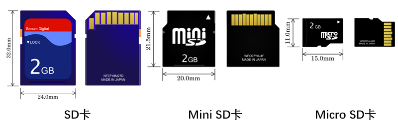
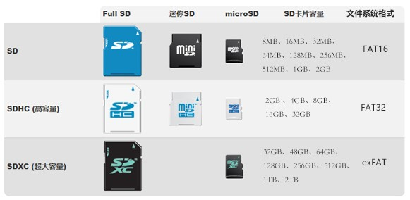
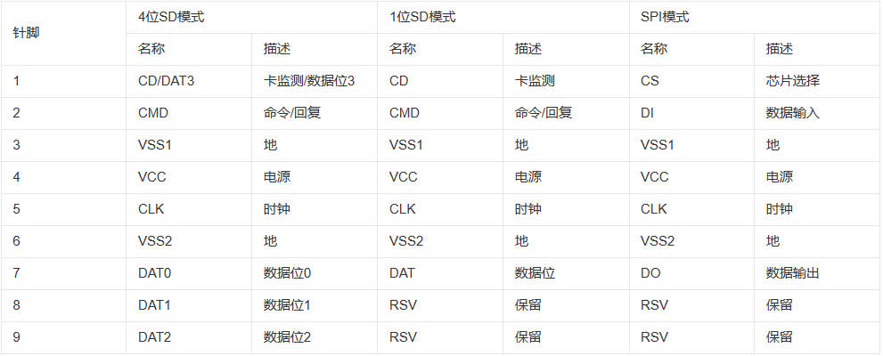
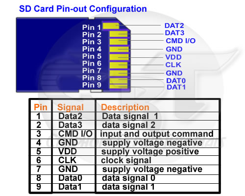
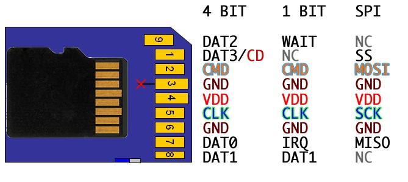
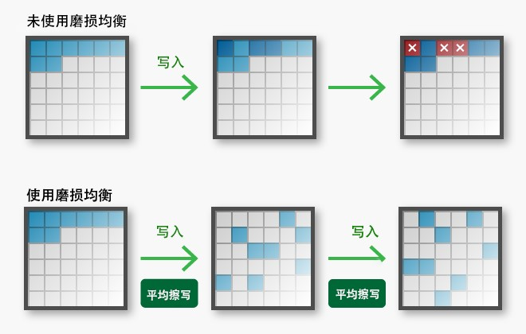

# 【理论】SD卡知识科普

相信大家对SD卡都不陌生了，因为SD卡已经深深渗透在我们的日常生活中，比如数码相机、手机、游戏机等都会需要用到它。

SD存储卡是一种基于半导体快闪记忆器的新一代记忆设备，SD卡的英文全称是：`Secure Digital Memory Card/SD card`，缩写是：`SD`；中文名全称是：`安全数码卡`。

## SD卡的分类

随着SD技术的发展，出现了各种SD卡衍生产品，多种容量与多种尺寸也让SD卡成为各种设便携设备的主要选择。每种SD卡之间的存在着不小的差异。

根据外型尺寸，可以将SD卡划分为三种类型：SD卡、Mini SD卡、Micro SD卡（旧称TF卡）。

标准SD是规格最大的一种，今天市面上大多数消费级数字相机和摄像机均使用此标准的SD卡，这种卡有标准的“缺角”设计。

Mini SD卡，在性能上与标准SD卡并无太大区别，主要是尺寸更小。Mini SD卡特点是体积小巧、性能稳定，配合专用转接卡使用，可完全兼容标准SD卡插槽。而且Mini SD卡采用的是低耗电的设计，比标准SD卡更适用于移动通信设备,因此主要进攻手机、PDA、掌上电脑的信息终端。

Micro SD 卡，原名Trans-flash Card（TF卡），在2004年正式更名为Micro SD 卡，由闪迪（SanDisk）公司发明，主要应用在移动手机。

根据SD卡的容量，可划分为SD、SDHC（SD High Capacity）、SDXC（SD Extended Capacity）三种标准。现今，市场的主流SD产品是SDHC和SDXC这两种较大容量的存储卡，而SD卡因容量过小，已逐渐被市场淘汰。

> Windows 和Mac OS操作系统可以很好地支持FAT16、FAT32文件系统格式；exFAT文件系统格式可以在Windows 7、Windows 8、Mac OS X 10.6.6及以上版本中使用。

## SD卡的速度等级

每张SD卡的数据传输速度，都不尽相同。所以SD协会是根据视频匀速录入到记忆卡的最低持续速度来划分不同等级，每个等级的速率是以每秒传输多少MB来衡量的，单位为MB/S。

SD协会定义了三种速度等级：速度等级、UHS速度等级与视频速度等级。三种速度等级的具体传输速度如下表：

最低写入速度 | 速度等级          | UHS速度等级 | 视频速度等级 | 支持4K视频
------------|------------------|------------|-------------|-----------
2MB/S       | Class 2 (C2)	   | ——	        |  ——	      | ×
4MB/S       | Class 4 (C4)	   | ——	        |  ——	      | ×
6MB/S       | Class 6 (C6)	   | ——	        | 6级(V6)	  | ×
10MB/S      | Class 10 (C10)   | UHS-1	    | 10级(V10)	  | ×
30MB/S      | ——               | UHS-3	    | 30级(V30)	  | √
60MB/S      | ——               | ——	        | 60级(V60)	  | √
90MB/S      | ——               | ——	        | 90级(V90)	  | √

### 速度等级

从SD2.0的规范开始，对SD普通卡和高速卡的速度分级是：Class2、Class4、Class6 和Class 10 四个等级。

### UHS速度等级

UHS（Ultra High Speed）是与SDXC同时推出的SD卡总线标准。UHS速度等级适用于SDHC和SDXC。

SD协会定义的UHS速度等级是UHS速度等级1(UHS-1）和UHS速度等级3(UHS-3）。U1和U3可应用于UHS总线IF产品系列(UHS-I，UHS-II和UHS-III）。厂商一般会直接在SD卡上标注速度，这可协助消费者透过读写标志来选择所需要的效能。

### 视频速度等级

视频速度等级定义为能满足高分辨率和高质量4K/8K视频录制的需求，它还具有支持下一代闪存类型（如3D NAND）的重要功能。此外，视频速度等级还涵盖了HD高清（2K）视频的速度。

SD 协会定义的视频速度等级为V6， V10， V30，V60和V90。V6和V10可应用于高速和UHS总线IF产品系列。V30可应用于UHS总线IF产品系列。V60和V90可应用于UHS-II / UHS-III产品系列。以摄像机为例，如果不清楚该SD卡的视频速度等级是否适合，通常生产商都会在摄像机说明书中给出最佳的速度等级建议。

## SD卡的容量等级

SD卡容量目前有3个级别，那就是SD，SDHC和SDXC。
下表为等级容量范围和标准磁盘格式：

容量等级 | 容量范围 | 磁盘格式
--------|----------|--------
SD      | 上限至2GB  |FAT 12,16
SDHC    | 2GB至32GB  | FAT 32
SDXC    | 32GB至2TB  | exFAT

- SD容量有8MB、16MB、32MB、64MB、128MB、256MB、512MB、1GB、2GB
- SDHC容量有2GB、4GB、8GB、16GB、32GB
- SDXC容量有32GB、48GB、64GB、128GB、256GB、512GB、1TB、2TB

## SD模式

### 驱动模式

SD卡有两种驱动模式：**SPI模式**与**SDIO模式**。它们所使用的接口信号是不同的。在SPI模式下，只会用到SD卡的4根信号线，即CS、DI、SCLK与DO(分别是SD卡的片选、数据输入、时钟与数据输出)。

### 传输模式

SD卡共支持三种传输模式：SPI模式（独立序列输入和序列输出），1位SD模式（独立指令和数据通道，独有的传输格式），4位SD模式（使用额外的针脚以及某些重新设置的针脚。支持四位宽的并行传输）。

SD卡三种传输模式的**针脚定义**：

## SD卡的闪存颗粒和使用寿命

### SD卡闪存颗粒

SD卡内部的两大重要构件——储存芯片和控制芯片，是影响SD卡性能的重要指标。SD卡在表面规格上是一致的，但其实每张卡采用的芯片可能不一样，甚至在使用寿命和使用流畅度上都存在着相当大的差距。

在SD卡中，只有大约1/3的面积是真正的存储区域。NAND颗粒是SD卡所使用的真正的记忆体。根据NAND闪存中电子单元密度的差异，又可以分为SLC(单层存储单元）、MLC(多层存储单元）、TLC(三层存储单元)以及QLC(四层存储单元)，此四种存储单元在寿命以及造价上有着明显的区别。

- SLC（单层存储单元），单层电子结构，写入数据时电压变化区间小，寿命长，约有10万次擦写寿命，造价高（约MLC3倍以上），多用于企业级高端产品。
- MLC（多层存储单元），使用高低电压的而不同构建的双层电子结构，寿命长，造价可接受，多用民用高端产品，约3000-10000次擦写寿命。
- TLC（三层存储单元），是MLC闪存延伸，TLC达到3bit/cell。存储密度最高，容量是MLC的1.5倍。 造价成本比TLC低， 速度慢寿命短，读写次数在1000~2000左右，是当下主流厂商首选闪存颗粒。
- QLC（四层存储单元），每个单元可储存4bit数据，跟TLC相比，QLC的储存密度提高了33%。QLC不仅能经受1000次编程或擦写循环（与TLC相当，甚至更好），而且容量提升了，成本也更低。

总的来说，在性能、耐用性和价格上：SLC> MLC> TLC＞QLC。

### SD卡的使用寿命

SD卡的使用寿命是有限的，尤其是低端的SD卡采用TLC 或QLC颗粒的，读写寿命就更为有限。
要想知道SD卡的使用寿命大概是多少，除了通过估算颗粒擦写次数，还可以通过SD卡的质保期来猜测。通常每个SD卡制造商会为自己的产品提供质保服务。在质保期内，SD卡通常都不会出现什么问题，但如果超出质保期,那就需提防会出现数据丢失或无法访问SD卡等问题。所以，SD卡的质保期大概就是SD卡的寿命。

除了以上的因素会影响到SD卡的使用寿命之外，还有一种因素是廉价劣质的SD卡不具有磨损均衡技术(Wear Leveling)。在磨损均衡SD卡中，磨损均衡算法通过将写入分配到闪存介质上的多个块(Block)，可平均控制每一个块的抹写次数，以避免特定块的过度使用该过程确保每个闪存块尽可能均匀地磨损。当不使用磨损均衡算法时，闪存往往会一遍又一遍地将数据写入相同的块，而根本不将数据写入某些块。这会导致过度使用的数据块磨损，即使仍有可用的块尚未接收到任何数据，也会使存储卡无法使用。

## SD卡易损坏的原因分析

SD卡给我们的生活带来了很多便利性，但也会有不可避免的缺陷。

SD卡的优点：

- 适用性广 — SD卡的体积小巧，具有多种尺寸和容量，非常适合作为移动设备的储存介质。
- 安全性较高 — SD卡通过加密功能，可以保证数据资料的安全保密。它还具备版权保护技术，所采用的版权保护技术是DVD中使用的CPRM技术(可刻录介质内容保护)。

SD卡的缺点：

- 易损坏 — SD卡体积小，容易出现物理损坏，容易被折断。同时，它的使用寿命会受到使用习惯和使用方式影响，不正确的使用方式将导致SD卡损坏。

从上面可以知道，SD卡最大的缺点是容易出现损坏问题。当你无法自主删除SD卡上的文件或提示需要格式化时，那就证明你的SD卡已经出现受损。
SD存储卡会因为各种原因出现损坏，比如以下几个原因：

1. 物理损坏

由于SD卡很小，很容易受到折断等物理损坏。尽管许多SD卡都是防水的,但若长时间放入水中，也会使其受到损害。另外，由于SD卡是一种半导体快闪记忆器，内部是电子器件制成的，当它受到静电放电时，就会很容易损坏。

2. 文件系统损坏

此外，智能手机或相机的操作系统也会对SD卡产生很大的影响。要访问SD卡中的数据，是必须通过相机/手机的操作系统才能访问。所以如果设备的操作系统出现故障，导致文件系统损坏，就会出现SD卡损坏、无法访问的情况。

3. SD卡坏扇区累积
与传统硬盘一样，随着时间的推移，在SD卡上出现坏扇区是不可避免的。所谓的坏扇区是指不能再存储数据的存储空间。当SD卡中的坏扇区一直积累，积累到某个程度SD卡就会突然爆发，使SD卡永久无法正常使用。

4. 插入或取出SD卡的方式不当

不当的插拔方式很容易使SD卡受到损害，如：在读写数据时，意外停止、拨出SD卡；拷贝数据未完成就强行拔出SD卡；频繁将SD卡插入不同的设备中。

5. 病毒或恶意软件感染

一个不能忽视的损坏原因是，SD卡受到病毒感染恶意软件的攻击。例如，如果您的智能手机意外下载了恶意软件。它会立即搜索存储在SD卡中的数据。在这种情况下，数据可能是不可读的，同时SD卡也很可能无法访问。

6. SD卡格式中断

有时，出于某些原因，您可能需要格式化SD卡。如果在格式化过程中出现错误而意外中断，则很可能会损坏SD卡。在这种情况下，修复它是非常困难的。所以您应该谨慎格式化SD卡。

7. 没有磨损均衡技术

大多数SD卡由于成本原因，基本上都没有使用增加闪存寿命的耗损平均技术，容易导致闪存中靠前的部分在多次擦写后失效，导致文件丢失或无法读取其中的数据。而且对单一块（Block）不断重复地写入和擦除，块会因过度使用造成读写速度变慢，严重者甚至会损坏而产生坏块。

8. 制造上的缺陷

除上述7个原因外，还应包括制造缺陷。在如今的存储卡市场中,SD卡的品牌繁多。有许多SD卡价格便宜，而有些则相对昂贵。价格差异的主要原因是它们的质量不同。质量差的SD卡必然会存在很多缺陷。劣质SD卡更容易受到损坏。

