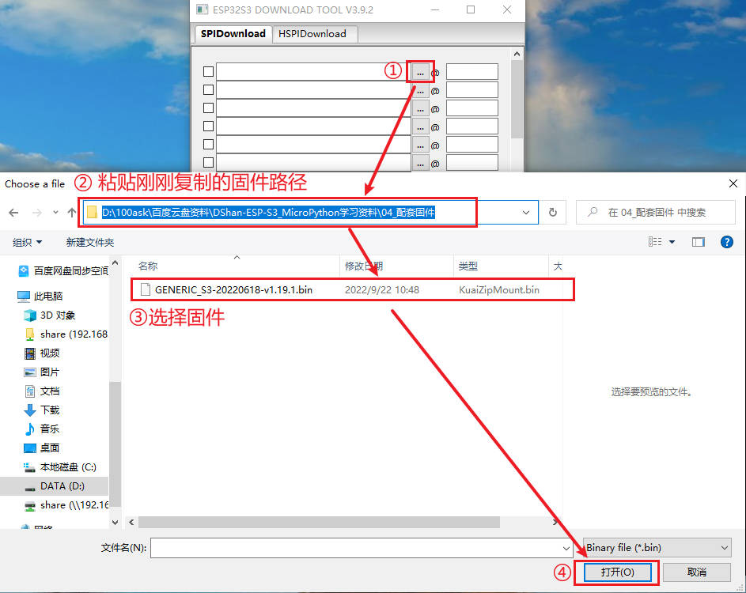
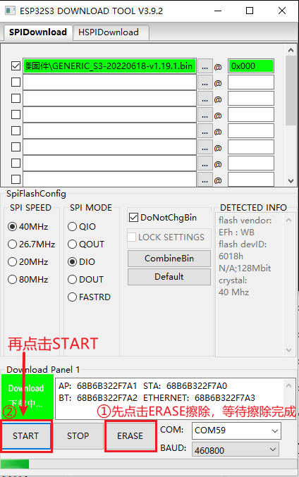
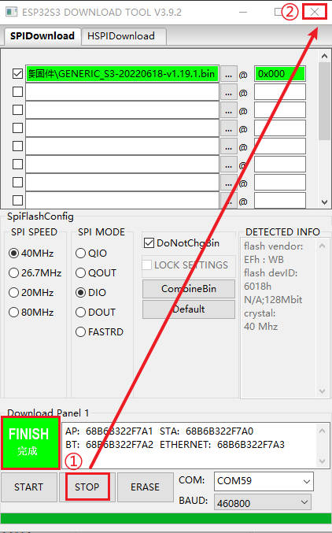

# 烧写固件

在开始搭建开发环境之前，我们要先将DshanMCU-Mio(澪)的windos驱动安装好，用于 MicroPython 交互的固件烧录好。

## 安装驱动

我们将 DshanMCU-Mio(澪) 上印有 UART 的 Type-C 接口，通过配套的 Type-C 线连接到我们的PC上的USB接口上，如下图所示：

在 Windows 10 操作系统中，一般在你接上之后不久就会提示正在自动安装驱动。

我们右键点击 **“我的电脑”** ，然后依次点击： 属性->设备管理。打开 **设备管理器** 界面之后能看到 `端口(COM和LPT)`选项， 并且其中有新接入的设备串口(COM)号，说明驱动没有问题，可以正常使用。

如果 **驱动异常**，那么就是你PC的系统无法自动安装驱动，这时候就需要我们 **手动安装驱动** ，方法如下：

如果驱动异常，我们新接入的设备会显示一个 **黄色的感叹号**，我们选中这个设备项，然后点击鼠标右键，在弹出的菜单栏中选择 `更新驱动程序`：

然后会弹出一个页面，我们选择 `“浏览计算机查找驱动”`：

驱动的路径选择： `DShan-ESP-S3_Arduino学习资料\03_开发工具\`，点击 `“确定”` 后就会安装驱动。

驱动安装完成之后，再检查 **设备管理器** 中是否有串口(COM)号。

> 资料中的驱动是压缩包，我们要先解压这个压缩包再选择驱动，这里略过解压操作教程。

## 烧录固件

DshanMCU-Mio(澪) 中需要烧写用于 MicroPython 交互的固件之后才能用来进行 MicroPython 开发。

我们将资料包中的 `03_开发工具/flash_download_tool_3.9.2_0.zip` 解压得到 `flash_download_tool_3.9.2` 目录：

进入 `flash_download_tool_3.9.2` 目录，双击 `flash_download_tool_3.9.2.exe` 打开：

然后会看到弹出了一个大的黑色窗口和一个可以交互小的窗口，在小窗口中按照图中所示逐项地点击对应地下拉框进行选择，三项都和图片中的一样之后，点击 `OK` 按钮：

然后进入到 flash_download_tool 的主界面：

接下来我们先找到我们要烧写的固件，我们的固件在资料包中的 `04_配套固件/` 目录中，后续会持续更新固件，现在只有一个固件 `GENERIC_S3-20220618-v1.19.1.bin`，通过文件名我们可以知道，这个固件是给 ESP32-S3 使用的，编译日期是 2022年06月18日，后续你可以选择你喜欢的固件进行烧写，建议选择编译时间最新的固件进行烧写。

找到固件所在的目录之后，我们点击 **文件资源管理器** 中的地址栏，将这个地址复制下来，如下图所示：

然后继续来到 flash_download_tool 的主界面，点击第一行的 `...` 按钮，在新打开的窗口粘贴刚刚复制的路径，然后按回车，然后在进入的目录中选择固件，最后点击打开按钮。操作过程如下图所示：

然后依次按照下图所示进行配置：

然后，先点击 `ESASE` 按钮进行擦除，等待擦除完成；再点击 `START` 按钮进行烧写，等待烧写完成：

最后，成功烧写完成提示**FINISH**，然后点击 `STOP` 按钮，关闭烧写工具：

至此，用于 MicroPython 交互的固件烧写好了，接下来搭建好开发环境就可以使用 DshanMCU-Mio(澪) 开发板进行 MicroPython 开发了！

> 这里我们不验证固件是否正常工作，如果使用我们配套的软硬件，那么这个概率低到可以忽略不计。我们验证工作放到了后面的章节中，在搭建好开发环境之后，我们会使用 DshanMCU-Mio(澪) 开发板体验 MicroPython 开发，如果在那个时候你发现不能正常工作，请回到这里的文档，重新烧写一遍固件。
