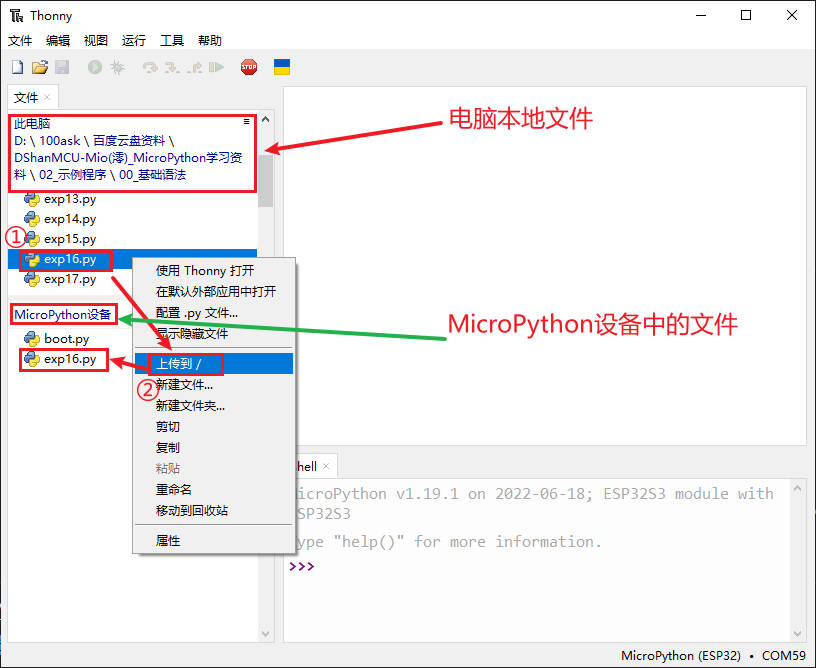

# 模块

前面我们通过定义函数，来实现代码的重用。但如果想让编写的函数，在其它Python程序里面也能使用，该怎么办呢？这就要引入Python的模块。

## 模块的导入

Python之所以那么受欢迎，其中一个原因就是有丰富的模块，我们可以通过“help("modules")”来查询固件内置的模块，也可以导入“import”其它模块。

我们后面的硬件编程，其实就是使用“machine”这个模块，使用这个模块提供的函数，实现对硬件的控制。

导入模块有两种方式，一种是使用“import”+模块名，另外一种是“from”+模块名+“import”+名字。前者导入的是整个模块，后者导入的模块指定名字的部分。

如下代码段所示，导入整个模块和部分导入。

```python
# 导入模块（exp15.py）

import math          # 导入整个数学函数模块
print(math.sqrt(64)) # 计算64的平方根

from math import pi, fabs # 从模块中导入个别值
print(pi)                 # 打印导入的pi
print(fabs(-40))          # 使用导入的fabs求绝对值
```

执行结果如下所示：

```shell
8.0
3.141593
40.0
```

## 自定义模块
一个Python文件，就可以当作一个模块，因此我们可以编写一个自定义模块，再在其它程序里面调用这个模块。

这里我们先创建一个“exp16.py”作为模块，如下代码段 所示。

```python
# 自定义模块（exp16.py）

def max_num(a, b):  
    "功能: 打印两个数字中较大的一个"
    if a>b:
        print(a, "is maximun")
    elif a<b:
        print(b, "is maximun")
    else:
        print(a, "is equal to", b)
```

这个模块文件要放到 DshanMCU-Mio(澪) 里面，这样其它程序才能找到调用。

勾选Thonny菜单栏的“文件”，如下图所示。


然后我们看到文件窗口出来了，我们点击 "此电脑" 浏览我们的磁盘，进入到我们的基础示例所在的目录：


双击 "基础语法" 目录，即可看到这样的窗口，这样只会展示此目录的内容，后面操作起来方便很多：


找到 “exp16.py” 文件，选中它，鼠标右边，选择 `上传到/` ，然后在 `MicroPython设备` 窗口会看到多了 “exp16.py” 文件，如下图所示：



然后在 Thonny 中创建 “exp17.py” ，调用刚才的模块，代码如下代码段所示：

```python
# 调用自定义模块（exp17.py）

import exp16

exp16.max_num(10, 35)

```

效果如下图所示：


