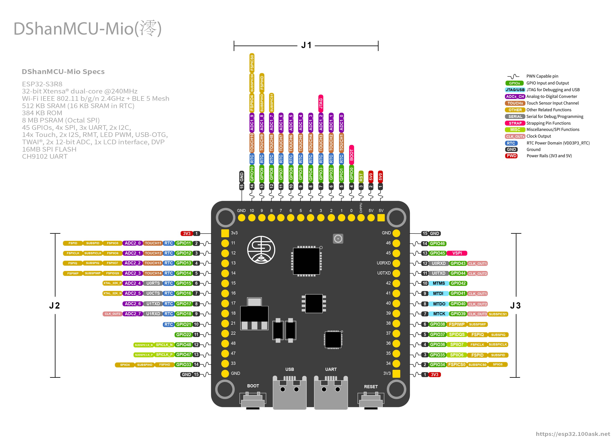

# ESP32-S3开发平台

为了让广大电子爱好者更好更方便地学习 EPS32 开发，百问网 DShan MCU 团队打造了一系列高性价比地学习套件和周边模块，支持在Arduino、ESP-IDF、MicroPython平台上学习和开发ESP32。我们的开发平台采用最小版+底板的设计形式，保留了官方原汁原味的兼容性的同时可以让学习、开发者能够更好地动手操作硬件、进行更多地拓展性实验；甚至融合到自己的项目中，拿去参加比赛等用途。

百问网 DShan MCU 系列提供了丰富的历程、文档和教程，基于我们的平台能确保所有的代码程序开箱即用，甚至可以将我们文档中的示例和实验应用在自己的产品研发、项目开发或者比赛中。

百问网 DShan MCU 系列资源、资料会保持活跃更新状态，如果你在学习时遇到任何相关的问题可以在我们的 [交流社区](https://forums.100ask.net/) 提问，会有专业的老师或者热心的同学一起帮你解决问题！

## DShanMCU-Mio(澪)开发板

DShanMCU-Mio(澪) 开发板由百问网 DShan MCU 团队设计研发，有以下主要特点：

- 有文档教程在：Arduino 平台学习、开发
- 有文档教程在：ESP-IDF 平台学习、开发
- 有文档教程在：MicroPython 平台学习、开发
- 存储资源拉满：高达支持 8MB 的 PSRAM 和 128MB 的 FLASH
- 自动下载电路
- USB OTG 接口
- 全IO引出
- 按键和LED排列整齐，丝印清晰查看方便
- 可用来学习AI (MicroPython)
- 支持百问网墨水屏和彩屏

DShanMCU-Mio(澪)引脚图：

点击此连接获取 DShanMCU-Mio(澪)引脚图 的超清原图：[https://forums.100ask.net/uploads/short-url/3O4SU8IJlfLQBi0vGaKCXECPAtB.zip](https://forums.100ask.net/uploads/short-url/3O4SU8IJlfLQBi0vGaKCXECPAtB.zip)

## DShanMCU-Mio(澪)功能参数表

| 功能 | 描述 |
| ----------- | ----------- |
| 主控        |  ESP32-S3     |
| 内存        |  512KBytes + 2M-8MBytes PSARM(选配) 标配 512KB+8MB     |
| FLASH       |  8M-128MBytes (选配) 标配 16MB  |
| KEY         |  连接到引脚0     |
| I2C         |  支持任意IO    |
| UART        |  支持任意IO     |
| PWM         |  支持任意IO     |
| 双USB       |  1. USAR: 板载 USB转TTL   2.USB：USB OTG     |
| 5V          |  USB供电输入、对外供电输出     |
| 3.3V        |  3.3V输出，最大电流 600mA     |
| 墨水屏      |  支持局刷、快刷，提供LVGL开发教程、示例    |
| SPI彩屏     |  SPI接口，提供LVGL开发教程、示例     |

## DShanMCU-Mio(澪)开发套件

【图】 DShanMCU-Mio(澪)引脚图（墨水屏）

| 配置 | 描述 |
| ----------- | ----------- |
| 核心板        |  DShanMCU-Mio(澪)     |
| 底板        |  100ASK_ESP32-S3_Base-Board    |
| 显示屏        |  3.52寸SPI接口黑白两色墨水屏  |

【图】 DShanMCU-Mio(澪)引脚图（SPI彩屏）

| 配置 | 描述 |
| ----------- | ----------- |
| 核心板        |  DShanMCU-Mio(澪)     |
| 底板        |  100ASK_ESP32-S3_Base-Board    |
| 显示屏        |  3.5寸SPI接口TFT彩屏  |

## 100ASK_ESP32-S3基础底板

100ASK_ESP32-S3_Base-Board 是百问网 DShan MCU 团队针对 DShanMCU-Mio(澪) 在多开发平台上学习开发而量身定制的底板。可以用于在 Arduino、ESP-IDF、MicroPython平台上进行学习、开发，通过100ASK_ESP32-S3_Base-Board能让我们能学习更多的内容做更多地实验；同时强大的拓展性，能让使用者能做更多的DIY。下面是100ASK_ESP32-S3_Base-Board的功能说明：

【图】 100ASK_ESP32-S3_Base-Board功能说明

| 接口 | 描述 |
| ----------- | ----------- |
| 2.54mm排针 引出   |  可编程的GPIO引脚     |
| 墨水屏接口        |  接墨水屏     |
| TFT屏接口         |  接TFT屏幕     |
| TFT屏触摸接口      |  接TFT屏幕触摸     |

## 配套模块

TODO

## 拓展配件

3.52寸SPI接口无触摸黑白两色支持快刷局刷墨水屏

3.5寸SPI接口电阻触摸彩屏

