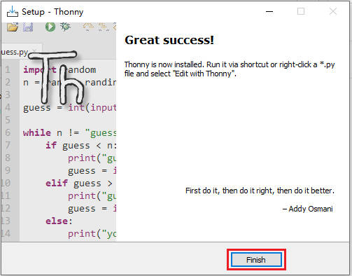
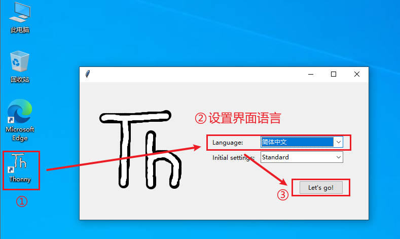
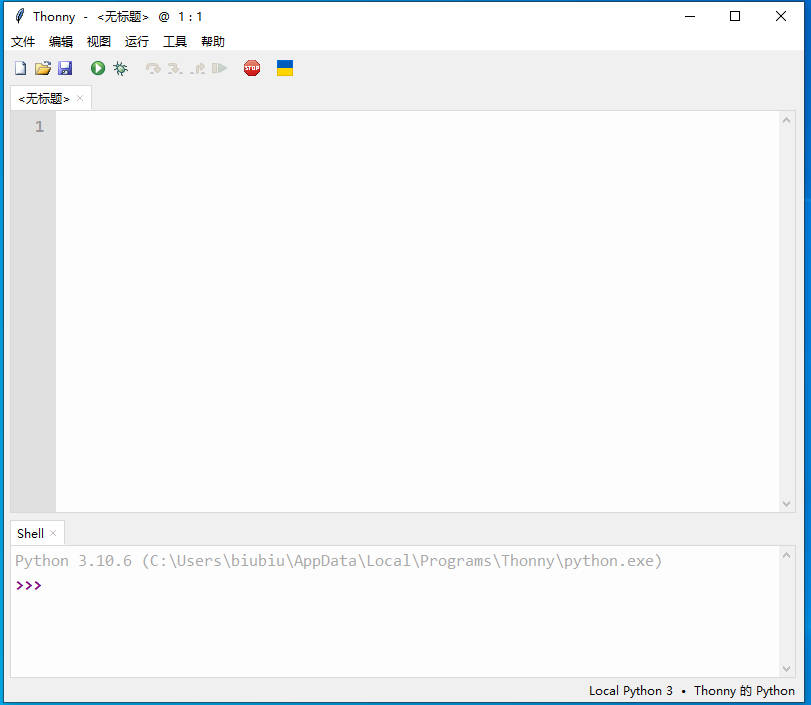
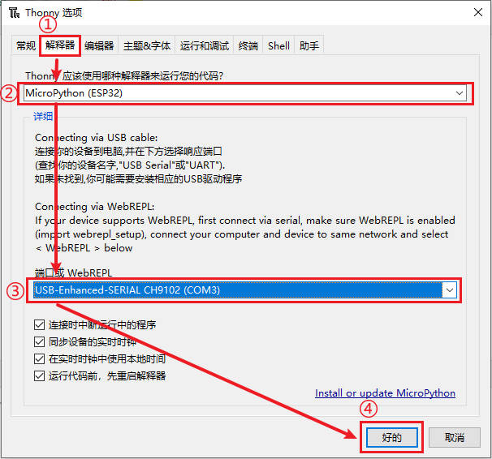

# 基于Windows平台搭建开发环境

Windows应该是大家常见的工作平台，即使是我们这些开发人员也是如此。所以我们也是推荐大家使用Windows平台作为首选的开发环境，并且推荐使用 Windows 10 系统。因为微软官方已经官宣停止对Windows 7 的更新和维护，所以我们最好不好使用windows 7以及比windows 7 更低的版本来搭建开发环境，否则可能会出现各种不必要甚至是无法得到解决的问题。

windows 10还有一个优点是，很多驱动都能自动联网安装，免去了我们手动安装的麻烦，比如我们将 DshanMCU-Mio(澪) 第一次接入我们PC上的时候，如果使用的是 Windwos 10 系统，那么会有弹窗提示正在安装驱动，这是非常智能方便的。

当然了，如果你确实只能使用其他版本的Windows系统，那么在出现问题的时候也是可以在我们的 [交流社区](https://forums.100ask.net/c/esp/49) 提问，会有专业的老师或者热心的同学一起帮你解决问题！

## 安装Thonny

Thonny由塔尔图大学开发，号称是适合Python初学者的IDE，其界面没有任何复杂或多余功能，很容易上手。大家可以从Thonny官网([https://thonny.org/](https://thonny.org/))获取Thonny的 Windows 安装包，我们的资料包中也提供了Thonny 安装包，如下图所示：

双击打开 **thonny-4.0.1.exe** 安装程序，首先弹出安装界面，选择 `Install for me only`，如下图所示：

随后弹出安装欢迎界面，按照默认的选项进行：

点击 `Install` 正式将 Thonny 安装到你的windows系统中，等待安装完成：

安装完成界面，点击 `Finish` 即可：

## 设置Thonny

我们点击桌面上的 **Thonny** 图标即可打开 Thonny，第一次打开要进行一些设置：

点击 `Let's go!` 按钮，进入 Thonny 主界面：

接着，使用配套的 Type-C 线，将DshanMCU-Mio(澪)开发板的 UART接口 和电脑USB口连接，正常连接后，我们会看到绿色的电源灯亮起

点击菜单栏的 `工具->选项`

进入到 Thonny 的设置界面，点击 `解释器` 后进行如下图所示的配置，最后点击 `好的` 按钮会自动连接你所设置的串口号：

连接成功后，可以在shell（串口终端）看到固件的相关信息，并且 **shell** 也可以使用了：

## 体验Thonny

我们在 Shell里面输入 print("Hello 100ASK!") , 按回车，可以看到会给我们返回 "Hello 100ASK!" 字符串：

试一下进行一些简单的计算，输入 1+1 ，按回车看看：

至此，我们的开发环境就完全搭建好了，接下来的章节中我们开始进行更多的实验、学习更多的内容吧！

