# 第二章 快速搭建开发环境

在上一章节中，我们了解了什么是ESP32、什么是MicroPython。我们已经对这两个方面有了一定的了解，万事俱备，只欠东风。在正式开始学习或者说编程之前，我们还需要将我们的开发环境搭建起来。

搭建开发环境我们离不开两个东西： 硬件平台+软件平台。

下面我们就来动手将我们的 DshanMCU-Mio(澪) + MicroPython 开发环境搭建起来。这其中我们提供了多种系统平台的搭建方法，你只需要选择你常用的一种平台即可，比如你的PC使用的是 Windwos 系统，在阅读玩 **准备工作** 之后，只需要看 Windows 平台的部分即可。

在搭建环境之前，我们需要先获取到学习资料包，下面我们先来看看 DshanMCU-Mio(澪) 的学习资料。

## 获取学习资料

[DShanMCU-Mio(澪)](https://forums.100ask.net/t/topic/1033)学习资料 [百度云盘](http://wiki.100ask.org/BeginnerLearningRoute#.E7.99.BE.E5.BA.A6.E7.BD.91.E7.9B.98.E4.BD.BF.E7.94.A8.E6.95.99.E7.A8.8B) 或 [阿里云盘](https://www.aliyundrive.com) 下载

| 下学习平台 | 下载链接 | 提取码 |
| :--- | :--- | --- |
| Arduino | 百度云盘：[https://pan.baidu.com/s/1rpC0JZj6wZ2wea3NyPXTvQ?pwd=root](https://pan.baidu.com/s/1rpC0JZj6wZ2wea3NyPXTvQ?pwd=root)  阿里云盘：[https://www.aliyundrive.com/s/rUaAUeA8H1m](https://www.aliyundrive.com/s/rUaAUeA8H1m) | 百度云盘：root   阿里云盘：k61h |
| ESP-IDF| 百度云盘：[https://pan.baidu.com/s/1lNVxmixhmOdPFSmtCMUMbg?pwd=root ](https://pan.baidu.com/s/1lNVxmixhmOdPFSmtCMUMbg?pwd=root)   阿里云盘：[https://www.aliyundrive.com/s/V1SsoMJWzk6](https://www.aliyundrive.com/s/V1SsoMJWzk6) | 百度云盘：root   阿里云盘：bt63 |
| Micropython | TODO | TODO |

> 获取最新的学习资料包，可以在上面的云盘下载来链接中获取，也可以关注我们的git仓库获取，同时非常欢迎提交你的 issues 或 Pull requests ！

示例、组件、库源码地址：

| 仓库名称 | 源码地址 | 说明 |
| :--- | :--- | --- |
| esp-arduino-learn  | [https://github.com/100askTeam/esp-idf-learn](https://github.com/100askTeam/esp-idf-learn) | Arduino 平台学习资料包 |
| esp-idf-learn | [https://github.com/100askTeam/esp-idf-learn](https://github.com/100askTeam/esp-idf-learn) | ESP-IDF 平台学习资料包 |
| esp-idf-components | [https://github.com/100askTeam/esp-idf-components](https://github.com/100askTeam/esp-idf-components) | ESP-IDF 平台的学习资料包的组件作为[esp-idf-learn](https://github.com/100askTeam/esp-idf-learn) 的子模块，也可以单独在自己的项目中使用！ |
| esp-micropython-learn | TODO | MicroPython 平台学习资料包 |

## 准备工作

在开始搭建开发环境之前，我们要先将DshanMCU-Mio(澪)的windos驱动安装好，用于 MicroPython 交互的固件烧录好。

### 安装驱动

我们将 DshanMCU-Mio(澪) 上印有 UART 的 Type-C 接口，通过配套的 Type-C 线连接到我们的PC上的USB接口上，如下图所示：

在 Windows 10 操作系统中，一般在你接上之后不久就会提示正在自动安装驱动。

我们右键点击 **“我的电脑”** ，然后依次点击： 属性->设备管理。打开 **设备管理器** 界面之后能看到 `端口(COM和LPT)`选项， 并且其中有新接入的设备串口(COM)号，说明驱动没有问题，可以正常使用。

如果 **驱动异常**，那么就是你PC的系统无法自动安装驱动，这时候就需要我们 **手动安装驱动** ，方法如下：

如果驱动异常，我们新接入的设备会显示一个 **黄色的感叹号**，我们选中这个设备项，然后点击鼠标右键，在弹出的菜单栏中选择 `更新驱动程序`：

然后会弹出一个页面，我们选择 `“浏览计算机查找驱动”`：

驱动的路径选择： `DShan-ESP-S3_Arduino学习资料\03_开发工具\`，点击 `“确定”` 后就会安装驱动。

驱动安装完成之后，再检查 **设备管理器** 中是否有串口(COM)号。

> 资料中的驱动是压缩包，我们要先解压这个压缩包再选择驱动，这里略过解压操作教程。

### 烧录固件

DshanMCU-Mio(澪) 中需要烧写用于 MicroPython 交互的固件之后才能用来进行 MicroPython 开发。

我们将资料包中的 `03_开发工具/flash_download_tool_3.9.2_0.zip` 解压得到 `flash_download_tool_3.9.2` 目录：

进入 `flash_download_tool_3.9.2` 目录，双击 `flash_download_tool_3.9.2.exe` 打开：

然后会看到弹出了一个大的黑色窗口和一个可以交互小的窗口，在小窗口中按照图中所示逐项地点击对应地下拉框进行选择，三项都和图片中的一样之后，点击 `OK` 按钮：

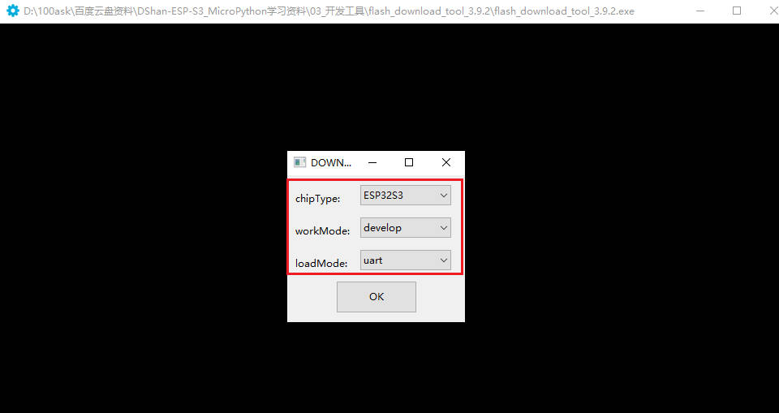

然后进入到 flash_download_tool 的主界面：

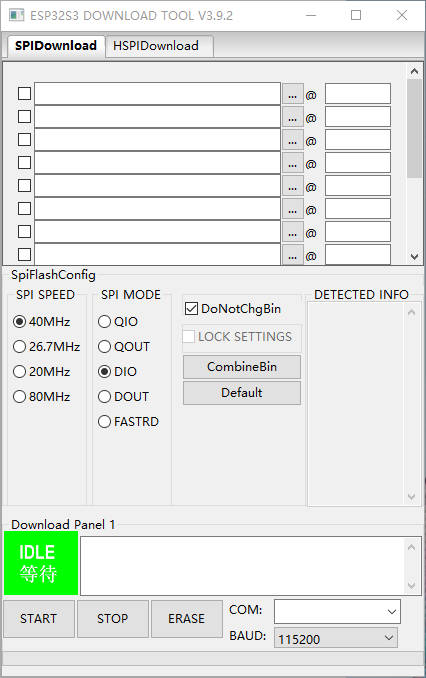

接下来我们先找到我们要烧写的固件，我们的固件在资料包中的 `04_配套固件/` 目录中，后续会持续更新固件，现在只有一个固件 `GENERIC_S3-20220618-v1.19.1.bin`，通过文件名我们可以知道，这个固件是给 ESP32-S3 使用的，编译日期是 2022年06月18日，后续你可以选择你喜欢的固件进行烧写，建议选择编译时间最新的固件进行烧写。

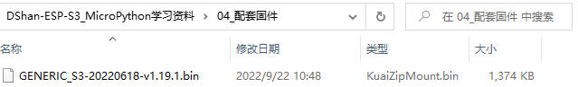

找到固件所在的目录之后，我们点击 **文件资源管理器** 中的地址栏，将这个地址复制下来，如下图所示：

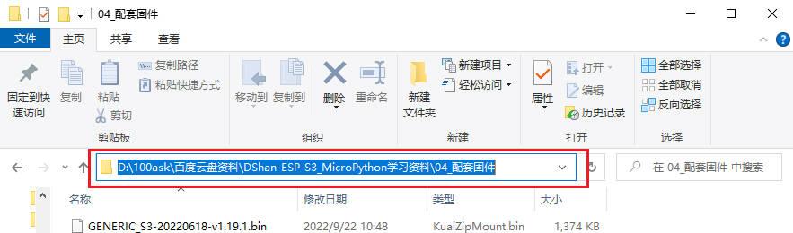

然后继续来到 flash_download_tool 的主界面，点击第一行的 `...` 按钮，在新打开的窗口粘贴刚刚复制的路径，然后按回车，然后在进入的目录中选择固件，最后点击打开按钮。操作过程如下图所示：

然后依次按照下图所示进行配置：

然后，先点击 `ESASE` 按钮进行擦除，等待擦除完成；再点击 `START` 按钮进行烧写，等待烧写完成：

最后，成功烧写完成提示**FINISH**，然后点击 `STOP` 按钮，关闭烧写工具：

至此，用于 MicroPython 交互的固件烧写好了，接下来搭建好开发环境就可以使用 DshanMCU-Mio(澪) 开发板进行 MicroPython 开发了！

> 这里我们不验证固件是否正常工作，如果使用我们配套的软硬件，那么这个概率低到可以忽略不计。我们验证工作放到了后面的章节中，在搭建好开发环境之后，我们会使用 DshanMCU-Mio(澪) 开发板体验 MicroPython 开发，如果在那个时候你发现不能正常工作，请回到这里的文档，重新烧写一遍固件。

## 基于Windows平台

Windows应该是大家常见的工作平台，即使是我们这些开发人员也是如此。所以我们也是推荐大家使用Windows平台作为首选的开发环境，并且推荐使用 Windows 10 系统。因为微软官方已经官宣停止对Windows 7 的更新和维护，所以我们最好不好使用windows 7以及比windows 7 更低的版本来搭建开发环境，否则可能会出现各种不必要甚至是无法得到解决的问题。

windows 10还有一个优点是，很多驱动都能自动联网安装，免去了我们手动安装的麻烦，比如我们将 DshanMCU-Mio(澪) 第一次接入我们PC上的时候，如果使用的是 Windwos 10 系统，那么会有弹窗提示正在安装驱动，这是非常智能方便的。

当然了，如果你确实只能使用其他版本的Windows系统，那么在出现问题的时候也是可以在我们的 [交流社区](https://forums.100ask.net/c/esp/49) 提问，会有专业的老师或者热心的同学一起帮你解决问题！

### 安装Thonny

Thonny由塔尔图大学开发，号称是适合Python初学者的IDE，其界面没有任何复杂或多余功能，很容易上手。大家可以从Thonny官网([https://thonny.org/](https://thonny.org/))获取Thonny的 Windows 安装包，我们的资料包中也提供了Thonny 安装包，如下图所示：

双击打开 **thonny-4.0.1.exe** 安装程序，首先弹出安装界面，选择 `Install for me only`，如下图所示：

随后弹出安装欢迎界面，按照默认的选项进行：

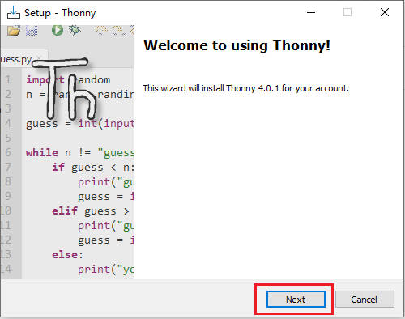

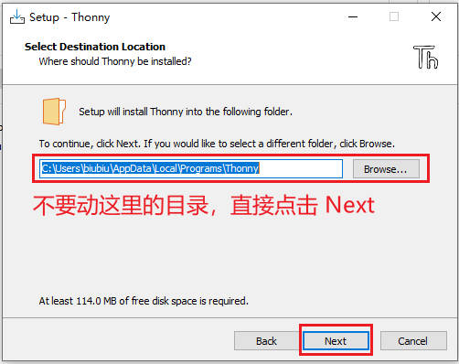

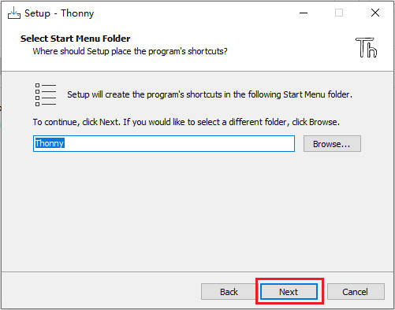

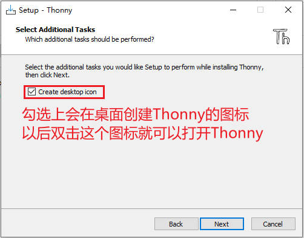

点击 `Install` 正式将 Thonny 安装到你的windows系统中，等待安装完成：

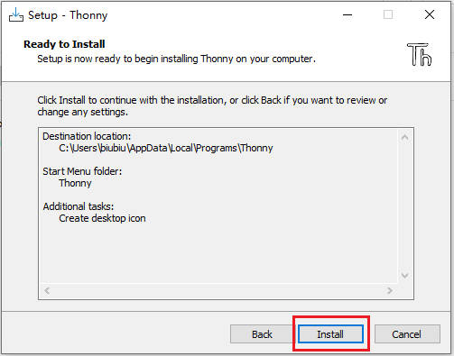

安装完成界面，点击 `Finish` 即可：

### 设置Thonny

我们点击桌面上的 **Thonny** 图标即可打开 Thonny，第一次打开要进行一些设置：

点击 `Let's go!` 按钮，进入 Thonny 主界面：

接着，使用配套的 Type-C 线，将DshanMCU-Mio(澪)开发板的 UART接口 和电脑USB口连接，正常连接后，我们会看到绿色的电源灯亮起

点击菜单栏的 `工具->选项`

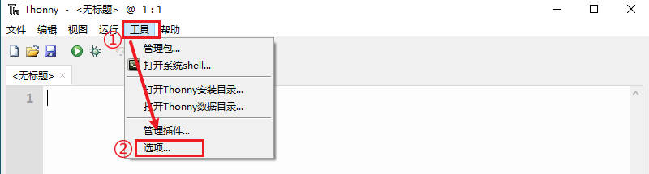

进入到 Thonny 的设置界面，点击 `解释器` 后进行如下图所示的配置，最后点击 `好的` 按钮会自动连接你所设置的串口号：

连接成功后，可以在shell（串口终端）看到固件的相关信息，并且 **shell** 也可以使用了：

### 体验Thonny

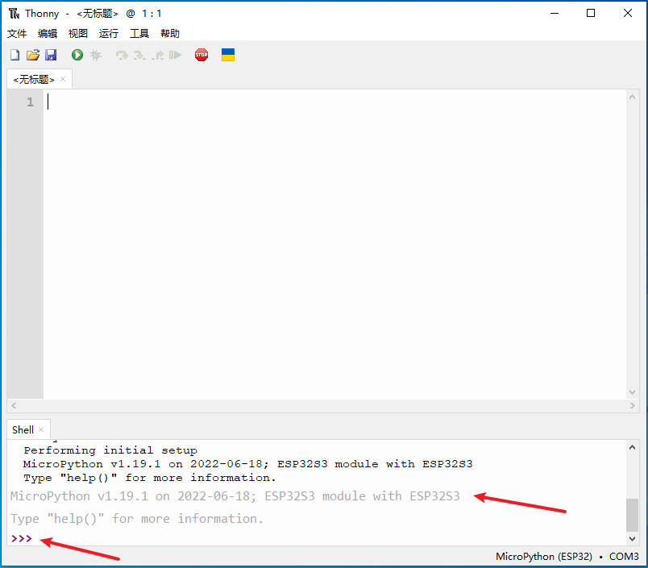

我们在 Shell里面输入 print("Hello 100ASK!") , 按回车，可以看到会给我们返回 "Hello 100ASK!" 字符串：

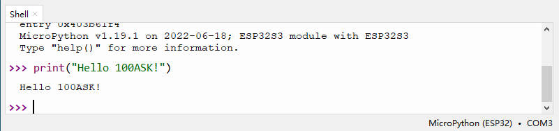

试一下进行一些简单的计算，输入 1+1 ，按回车看看：

至此，我们的开发环境就完全搭建好了，接下来的章节中我们开始进行更多的实验、学习更多的内容吧！

## 基于Linux平台(Ubuntu)
待续...

## 基于MacOS平台
待续...

