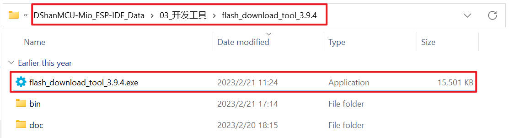
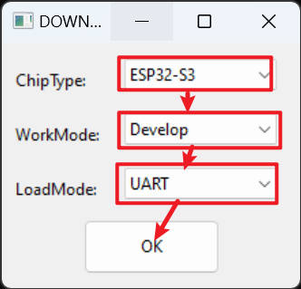
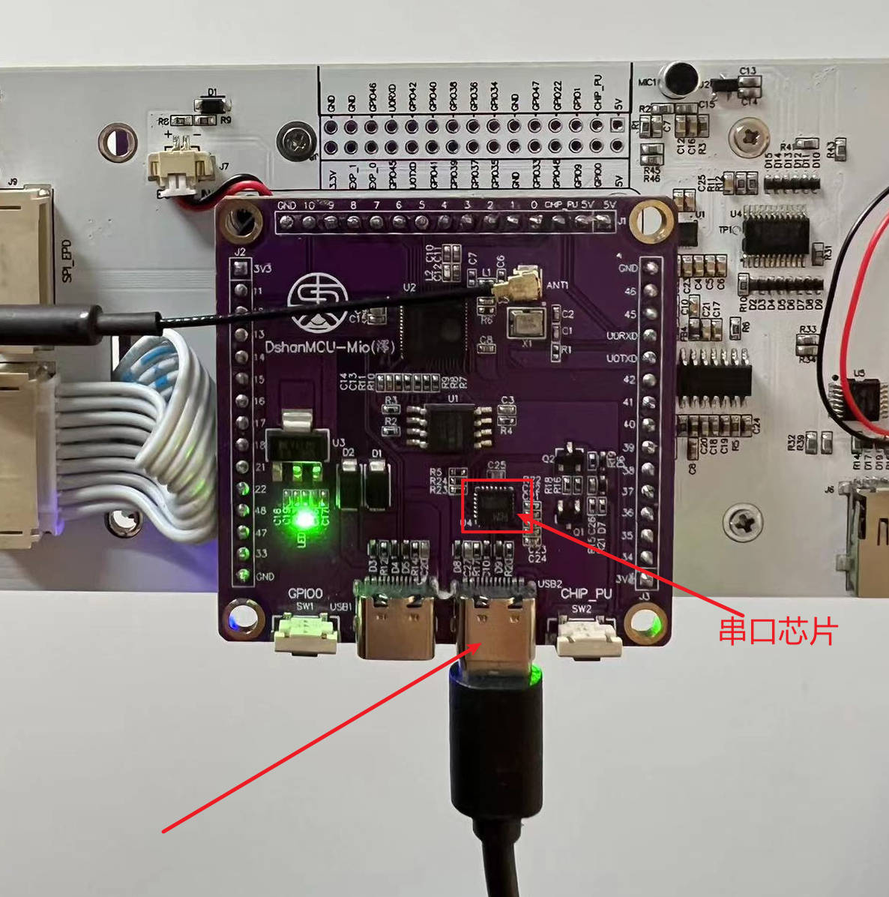
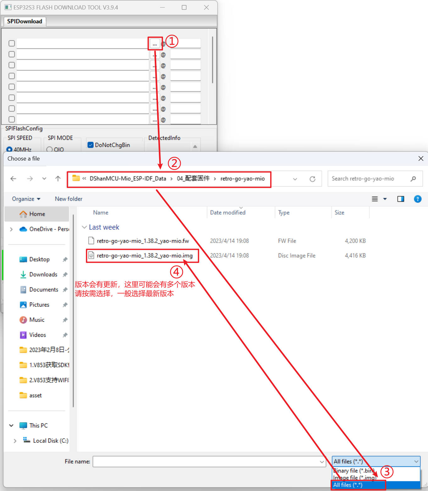
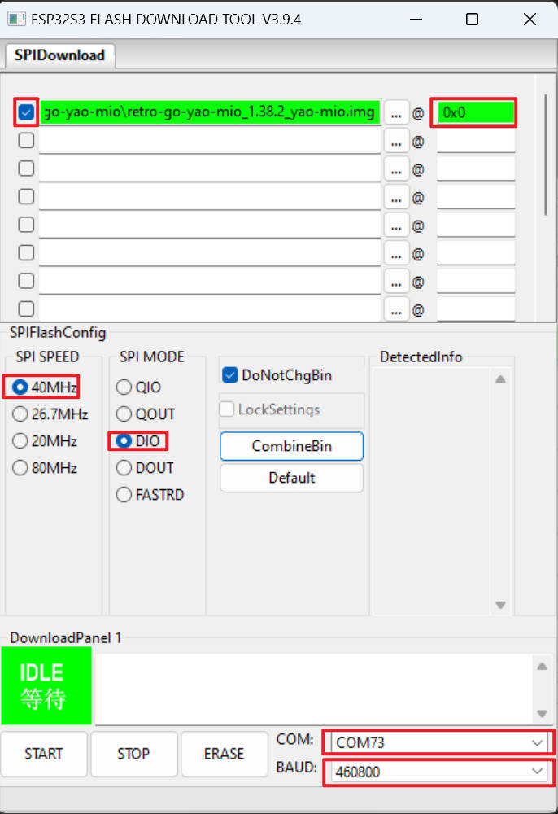
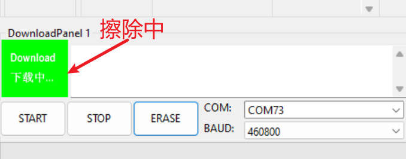
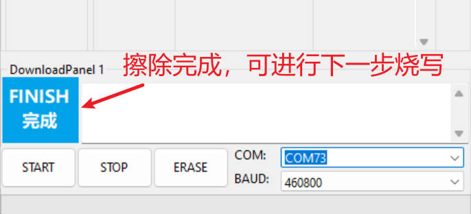
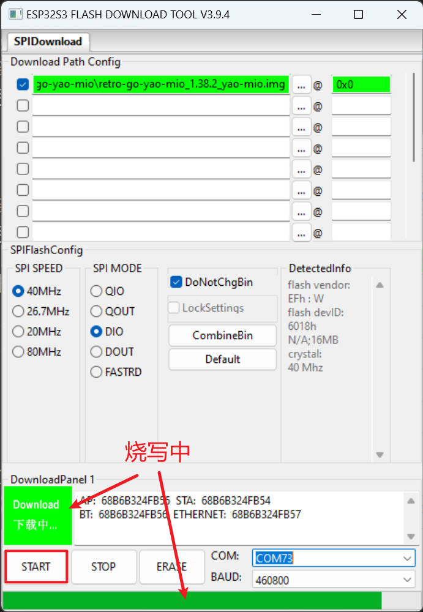
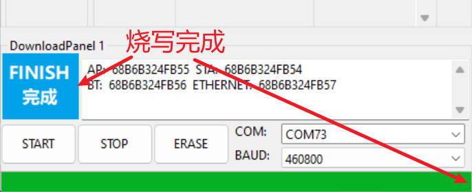
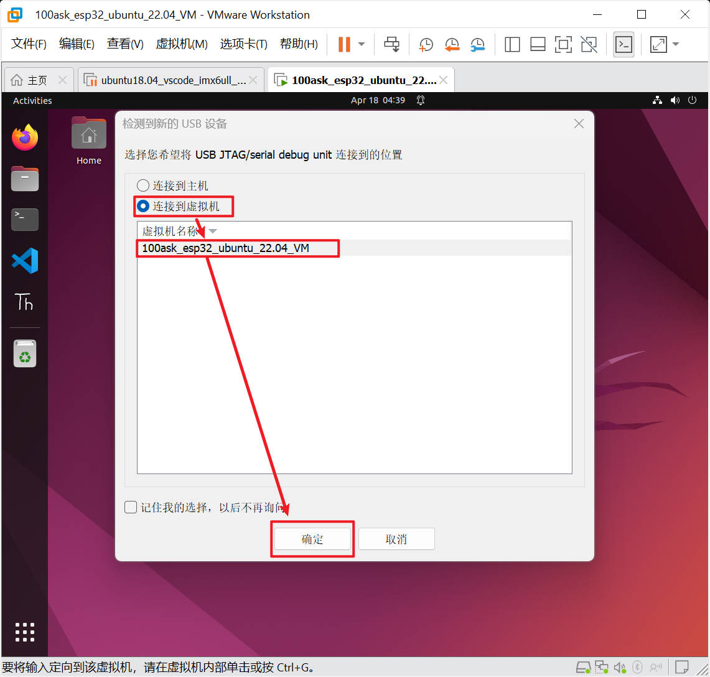

# Retro Yao-Mio 镜像文件的烧写

在上一章节中我们了解了 Retro Yao-Mio 学习套件的硬件清单、如何组装、以及获取了学习资料包。

> 如果是购买整套开发套件，开箱即用，也就是打开电源开关即可正常使用。

## 获取 Retro Yao-Mio 镜像文件

有三个地方可以获取到 Retro Yao-Mio 配套的镜像文件(retro-go-yao-mio)：

1. 在资料包中获得，其路径为：`DShanMCU-Mio_ESP-IDF_Data/04_配套固件/retro-go-yao-mio`
2. 在社区直接下载：[https://forums.100ask.net/t/topic/2991](https://forums.100ask.net/t/topic/2991)
3. 在 gitee 仓库的 release 中获得，其地址为：[https://gitee.com/weidongshan/retro-go-yao-mio/releases](https://gitee.com/weidongshan/retro-go-yao-mio/releases)
4. 在 github 仓库的 release 中获得，其地址为：[https://github.com/100askTeam/retro-go-yao-mio/releases](https://github.com/100askTeam/retro-go-yao-mio/releases)


在获取到镜像文件之后，如果需要烧写镜像文件，请根据自身实际情况任选一种方法按照其步骤进行。

## 1. 使用sd卡更新

这个方法适合 DShanMCU-Mio 本身已经烧写了 retro-go-yao-mio 镜像的情况使用，也就是提供固件文件让 DShanMCU-Mio 直接通过固件文件进行更新。

该功能状态：未完成(TODO)

## 2.Windows平台烧写

在windows平台上，我们使用乐鑫官方提供的 Flash 下载工具：`flash_download_tool`，该工具在资料包可以获取到。这个工具可以乐鑫官网这个地址获取最新的版本：[https://www.espressif.com.cn/zh-hans/support/download/other-tools](https://www.espressif.com.cn/zh-hans/support/download/other-tools)

1. 进入到资料目录： `DShanMCU-Mio_ESP-IDF_Data\03_开发工具`
2. 解压 `flash_download_tool.zip` 这里不标明版本号，因为改软件会更新，一般只保留最新的版本，请灵活选择。
3. 进入到解压后的目录 **flash_download_tool**，打开 **flash_download_tool.exe**，以 flash_download_tool_3.9.4.exe 为例：



4. 打开 flash_download_tool.exe 之后，会弹出一个黑色的DOS界面和 flash_download_tool.exe 界面入口，共两个窗口，黑色那个窗口不用理会(也不要在flash_download_tool运行期间将其关闭)，当将 flash_download_tool 关闭之后其会自动关闭。flash_download_tool入口配置如下：



当点击 `OK` 之后会进入到 flash_download_tool 主界面，这里我们就可以进行烧写了，我们烧写 retro-go-yao-mio 固件的操作步骤如下：

1. 按照下图所示对硬件进行接线，也就是将 USB Type-C 接入DShanMCU-Mio 正面右边的Type-C口(正对着串口芯片)：



2. 选择固件：



3. 配置下载选项：



当接上DShanMCU-Mio之后，COM口会自动识别并更新出来，点击COM所在的下来列表选择COM，请按照自己的实际情况选择正确的COM。

4. 配置好后，先点击 `ERASE` 按钮擦除Flash中的内容，刷除成功后，左边框出现完成字样：

擦除中



擦除完成



5. 擦除完成后，继续点击 `START` 按钮进行烧写：

烧写中



烧写完成



烧写完成之后，关闭 flash_download_tool，之后将 USB Type-C 断开，然后重启或启动 DShanMCU-Mio 即可进入 retro-go-yao-mio 系统，开始尽情畅玩！

## 3.Linux平台烧写

这里我们使用已经搭建了esp-idf开发环境的Ubuntu系统。建议使用在前面获取资料章节中获取到的[Ubuntu虚拟机](http://esp32.100ask.net/#/DShanMCU-Mio/ESP-IDF/chapter2-3)。

- 配套虚拟机及VMware-workstation获取地址：[http://esp32.100ask.net/#/DShanMCU-Mio/ESP-IDF/chapter2-3](http://esp32.100ask.net/#/DShanMCU-Mio/ESP-IDF/chapter2-3)

1. 打开Ubuntu虚拟机，进入到Ubuntu桌面。

2. 按照下图所示对硬件进行接线，也就是将 USB Type-C 接入DShanMCU-Mio 正面右边的Type-C口(正对着串口芯片)：


3. 如果弹出下面的窗口请，请选择连接到虚拟机：



4. 使用u盘将固件复制到虚拟机中或者虚拟机中的浏览器 [下载](#获取-retro-yao-mio-镜像文件)。

5. 这里将固件存放在虚拟机的 Download/yao-mio 目录下，进入到这个目录，在这个目录下空白的地方单击鼠标右键，然后选择 `Open in Termianl`：


6. 进入 终端控制台(termianl) 之后，开始烧写，烧写过程如下：

```shell
ubuntu@ubuntu-2204:~/Downloads/yao-mio$ ls
retro-go-yao-mio_1.38.2_yao-mio.img
ubuntu@ubuntu-2204:~/Downloads/yao-mio$ get_idf
ubuntu@ubuntu-2204:~/Downloads/yao-mio$ esptool.py write_flash --flash_size detect 0x0  retro-go-yao-mio_1.38.2_yao-mio.img 
esptool.py v3.3.2-dev
Found 1 serial ports
Serial port /dev/ttyACM0
Connecting...
Detecting chip type... ESP32-S3
Chip is ESP32-S3
Features: WiFi, BLE
Crystal is 40MHz
MAC: 68:b6:b3:24:fb:54
Uploading stub...
Running stub...
Stub running...
Configuring flash size...
Auto-detected Flash size: 16MB
Flash will be erased from 0x00000000 to 0x0044ffff...
Warning: some reserved header fields have non-zero values. This image may be from a newer esptool.py?
Compressed 4521984 bytes to 2559229...
Wrote 4521984 bytes (2559229 compressed) at 0x00000000 in 49.5 seconds (effective 730.6 kbit/s)...
Hash of data verified.

Leaving...
Hard resetting via RTS pin...
ubuntu@ubuntu-2204:~/Downloads/yao-mio$ 
```

烧写完成之后，会自动重启 DShanMCU-Mio 进入 retro-go-yao-mio，之后请尽情畅玩吧！
